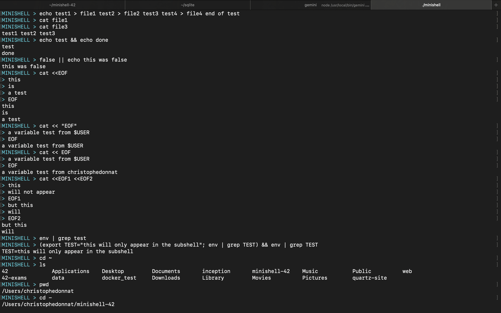

# PROJECT MINISHELL FOR 42
By chdonnat (Christophe Donnat from 42 Perpignan, France)

[🇫🇷 Voir la version française](README.fr.md)



## AIM OF THE PROJECT:

The goal of the project is to create a simplified shell that closely mimics the behavior of `bash`. This includes handling parsing, redirections, pipes, signals, and executing commands via `execve()`, except for built-in commands, which must be directly coded into minishell.

### BONUS PART:

To earn bonus points, the shell must handle:
- Logical operators: `&&` (AND) and `||` (OR).
- Parentheses `()` for command grouping.
- Wildcards `*` for filename expansion.

### Minishell and Memory Leaks
It is crucial to carefully handle memory leaks and file descriptor closures in a project like Minishell. The Makefile includes two options to help monitor leaks:
- On macOS: The compilation automatically uses the fsanitize tool. However, be aware that fsanitize is far less precise than valgrind.
- On Linux: The Makefile includes a make val rule that runs the program under valgrind, while ignoring leaks caused by the readline() function using the valgrind.sup suppression file.

## SOME COMMANDS YOU CAN USE:

compile the program and suppress the .o files:

	make && make clean

execute the program

	./minishell

 execute the program with valgrind excluding readline() leaks:

 (this uses the valgrind.sup file to suppress readline() leaks)

	make val

## ARCHITECTURE:
- minishell/ directory with the whole project
	- libft/ directory with the libft (+ get_next_line and ft_printf)
 	- dclst/ directory with functions and header for using doubly circular linked list
	- bonus/ directory with files for the bonus part
		- src/ directory containing the main files of the project
  			- builtins/ files for builtins commands
     			- env/ files with functions needed to interact with environment variables
        		- executor/ files to execute the command line
          		- lexer/ files for splitting the user input into tokens, store them in a chained list, check the syntax and create a binary tree
            		- signals/ files for handling signals
          		- text_transformer/ files for managing '$', '*' and '~'
		- utils/ directory for secondary files
		- include/ directory for headers
	- mandatory/ directory for the mandatory part (empty - everything is in the bonus directory)
- Makefile (with rules: make bonus clean fclean re)
- readme.md for quick explanation and main commands of the project
- valgrind.sup is a file containig a list of readline() leaks to suppress when executing valgring

## ABOUT MY PROJECT:

This minishell project was implemented with bonuses and several features that are not mandatory according to the subject.

As with my previous projects, I used functions to manipulate doubly linked circular lists (which I created during the FDF project), although using a linear list might have been simpler. All the functions for manipulating these lists can be found in the `/dclst` folder.  
Here’s an overview of how the project works:

---

#### **General Structure:**
Once the program starts, a general structure is initialized. This structure contains most of the elements and will be fully freed upon program termination, even though many elements will be reset with each user input.  
At startup, the structure dynamically allocates and stores a copy of the environment variables (while also updating the `SHLVL` and `SHELL` variables). This copy is used for environment variable management throughout the minishell's execution.

---

#### **LEXER:**
Once the user input is recorded, it is split into different tokens, stored in structures (organized as linked lists). Each token contains a portion of the user's input string, along with additional information (e.g., the token type, whether there is a space after the token, whether it is enclosed in single or double quotes, and whether the string was dynamically allocated).  

For tokens, I aimed to work solely with pointers referencing parts of the input string to avoid dynamically allocating memory for the string fragments stored in the tokens. However, this effort proved somewhat unnecessary later in the program. Specifically, when handling wildcards, I create new tokens with dynamically allocated strings, which is why I had to add a flag to determine which strings to free later. Nonetheless, this approach remains interesting for those not planning to implement the project's bonuses.  

Once the token list is created, its syntax is validated in the `check_syntax` function. If the input ends with `||`, `&&`, or `|`, an additional prompt is opened for the user to complete their input. If the input syntax is invalid, an error message is displayed.

The token list is then passed to a function that creates a **binary tree** by traversing the list from right to left, searching for operators like `||`, `&&`, `|`, or `;`. Each operator points to its left and right parts, and the tree is built recursively until reaching the leaves. Each leaf simply points to the leftmost token between operators. Binary tree is not necessary if you do not plan to do the bonus part.

---

#### **EXECUTOR:**
The executor traverses the binary tree in the `exec_tree` function. If it encounters a leaf, it executes it. If it encounters an operator, it executes the left and right parts (under certain conditions). The pipe operator is more complex because it must create heredocs if they are found in its child branches before creating the pipe (whereas heredocs are normally created during leaf execution if there are no pipes).  

When the executor reaches a leaf, the `exec_leaf()` function processes input and output redirections from left to right, then proceeds to the `exec_cmd` function, which creates an array of strings via the `extract_args` function (the arguments are first processed in the TEXT TRANSFORMER functions to replace characters as needed). This array contains the command and its arguments. Depending on the first argument in the array (the command name), the array is sent to the appropriate function: if the command corresponds to a builtin (the few commands coded into minishell), the relevant function is called with the array as an argument; otherwise, the `execve_cmd` function is called.  

The `execve_cmd()` function checks if the command is located in one of the directories listed in the `PATH` environment variable, then executes the command in a child process via `execve()`. If the command is not found, an error message is displayed.  

Parentheses are both a token and a special type of leaf in the tree: the content within parentheses is recursively processed in a subshell executed in a child process. The content inside the parentheses is tokenized by the lexer and then executed by the executor.  

As you can see, I didn’t really implement traditional parsing. Instead, the function executing the leaf and the one creating the argument array are responsible for navigating the token list correctly to find the appropriate redirections and arguments.  
The functions for executing redirections, parentheses, and pipes are located in the "OPERATORS" folder.

---

#### **TEXT TRANSFORMER:**
During the creation of the argument array, the strings contained in the tokens pass through the `manage_dollar()` function, which returns a dynamically allocated string after replacing `$` with the corresponding environment variable value (if it exists; otherwise, it is replaced with an empty string).  

In the dollar manager, I also added support for `~` (which is not required by the subject): if a string contains only the `~` symbol or starts with `~/`, this character is replaced with the absolute path to the user's home directory (I store the value of the `HOME` variable in the general structure when minishell starts, meaning that if this value is modified before launching minishell, `~` will not work correctly).  

The text transformer also includes functions for handling wildcards: first, an array of strings containing the names of files and directories in the current directory is created. Then, each entry is compared with the input to find matches for the wildcard, and a new array of strings is created with each matching entry. Based on this array, new tokens are created and inserted into the token list.  

For input or output redirections, the program first checks if more than one file or directory name matches the wildcard. If so, an error message is displayed.

---

#### **BUILTINS:**
The builtins are the commands directly coded into minishell.

### **cd:**
I chose to implement non-mandatory arguments, such as:
- `cd ~` (changes to the user's home directory),
- `cd -` (returns to the previous working directory),
- `cd` without arguments (changes to the home directory).  

Once the working directory is changed, the environment variables `PWD` and `OLDPWD` are updated.

### **pwd:**
Simply prints the current working directory.

### **env:**
Prints the environment variables array, excluding variables without a value (those registered without an `=`).
**Note:**  
Functions to manipulate environment variables (needed for export, unset, cd, ...) can be found in the ENV directory.

### **export:**
When used without arguments, the `export` command displays the environment variables sorted alphabetically (including those without an associated value) in a specific format.  
When used with arguments, it adds new environment variables or updates the value of existing ones, after verifying that the variable name follows certain rules:
- The first character of the name must be a letter or `_`.
- Subsequent characters must be alphanumeric or `_`.

**Note:**  
Variables are stored in the following format: `NAME=VALUE`.
If a variable is exported without a value, it is stored without the `=` character, unless it already exists in the environment variables list.
In that case, it is stored with the `=` character after its name but without an associated value.

### **unset:**
This command simply removes an environment variable. `unset` never returns an error, so even if the variable does not exist, it exits without an error.

### **`exit`:**
`exit` allows the program to terminate cleanly, returning either the exit status of the last command executed or the exit status provided as an argument.

---

#### **SIGNALS:**
Contains the functions to handle signals.

---

# DOCUMENTATION:

For explanations on functions and concepts already used in previous projects, refer to the README files of my other projects:

https://github.com/donnatchris/philosophers

https://github.com/donnatchris/minitalk

However, at the end of the DOCUMENTATION section, you will find a SHORT REMINDER section with a summary of all the previously covered functions.

---

### GITHUB COOPERATION

Here are the main commands to wotk with multiples branches:

#### Create a new branch and switch to that branch
```bash
git checkout -b <name_of_the_branch>
```

#### Switch to a branch
```bash
git checkout <name_of_the_branch>
```

#### Push your work on your branch
```bash
git add <name_of_file1> <name_of_file2> <...>

git commit -m "your_message"

git push origin <name_of_the_branch>
```

#### Merge your branch with main
```bash
git checkout main

git pull origin main #needed to fetch

git merge origin <name_of_the_branch>

git push origin main
```

---

### Tokens in minishell

A **token** is a sequence of characters in a string that represents a single unit of meaningful data.
In programming and parsing, tokens are the building blocks that the parser breaks input into for further processing.
Tokens can include keywords, identifiers, operators, literals, or symbols that are meaningful within a specific context.
For example, in a programming language, a token might represent a keyword like `if`, an operator like `+`, or a number like `42`.
In general, tokens allow the parser to understand and categorize different parts of an input string.

In the context of **Minishell**, tokens are the elements extracted from the user's input command line.
These can include commands, arguments, operators (such as `|`, `&&`, `>`, `<`), special symbols (like parentheses for grouping), or environment variables (e.g., `$HOME`).
Minishell parses the input by first breaking it into tokens, which are then used to construct an abstract syntax tree (AST) or to directly interpret and execute the commands.
Handling tokens correctly allows Minishell to process complex command lines, perform redirections, handle pipes, and expand environment variables, enabling it to execute user commands accurately and efficiently.

To ensure the correct execution of commands, here are the tokenisation I use:

1. **Parentheses `()`**  
   - Used for grouping commands and controlling the execution order within the shell.

2. **Logical AND `&&`**  
   - Used to execute the second command only if the first command succeeds. High priority to allow proper chaining of conditional commands.

3. **Logical OR `||`**  
   - Used to execute the second command only if the first command fails. Similar priority to `&&` for conditional command chaining.

4. **Pipe `|`**  
   - Allows output from one command to be passed as input to another. It should be processed next to handle command pipelines.

5. **Redirections `<`, `>`, `>>`, `<<`**  
   - Used to redirect input and output, including appending (`>>`) and reading until a delimiter (`<<`).
These should be handled after pipes to set up proper input/output flows, except that heredoc ('<<') temporary file is created before the pipes execution.

6. **Arguments**  
   - The command name and its arguments are processed last, once all operators and special tokens are handled.
   - I use 3 types of arguments:
  	- **word** are consecutive caracters containing no space
      	- **strings** are caracters contained inside double quotes
      	- **litteral** are caracters contained inside signe quotes (the matacaracters inside wil not be interpreted)

---

### What is a Binary Tree?

A **binary tree** is a hierarchical data structure in which each node has at most two children, referred to as the **left child** and the **right child**. It is a type of tree structure where each node stores a value and links to its two children (if any), forming a branching structure.

```mardown
	root
       /    \
     node    node
    /   \    /   \
  leaf  leaf  leaf  leaf
```


#### Key Characteristics:
1. **Root**: The topmost node in the tree, from which all other nodes descend.
2. **Parent and Child**: A node is a **parent** if it has at least one child. Nodes connected directly to another node are **children**.
3. **Leaf Nodes**: Nodes that have no children are called **leaf nodes**.
4. **Height**: The height of the tree is the length of the longest path from the root to a leaf node.
5. **Depth**: The depth of a node is the length of the path from the root to that node.

#### Types of Binary Trees:
- **Full Binary Tree**: Every node has either 0 or 2 children.
- **Complete Binary Tree**: All levels are filled except possibly the last, which is filled from left to right.
- **Perfect Binary Tree**: All internal nodes have exactly two children and all leaf nodes are at the same level.
- **Balanced Binary Tree**: The heights of the left and right subtrees of any node differ by at most one.
- **Degenerate (or Pathological) Tree**: A tree where each parent node has only one child, resembling a linked list.

#### Operations:
- **Insertion**: Adding a new node to the tree in an appropriate position.
- **Traversal**: Visiting each node in a specific order, such as **in-order**, **pre-order**, or **post-order** traversal.
- **Searching**: Finding a specific node or value in the tree, typically by traversing it.
- **Deletion**: Removing a node from the tree while preserving the binary tree structure.

#### Use Cases of Binary Trees:
- **Binary Search Tree (BST)**: A special type of binary tree in which the left child is less than the parent node and the right child is greater. It allows efficient searching, insertion, and deletion operations.
- **Expression Trees**: In the context of mathematical expressions, a binary tree can represent operators and operands, allowing for efficient parsing and evaluation.
- **Huffman Coding Tree**: A binary tree used in data compression algorithms for efficient encoding of data based on frequency.

Overall, binary trees are widely used in computer science for organizing and manipulating hierarchical data. They serve as the foundation for many more advanced data structures and algorithms.

#### **In Minishell**  
In **Minishell**, you I use the binary tree structure only to:  
✅ **Handle operator precedence** by constructing the binary tree to reflect the proper execution order, ensuring that operations like logical operators (e.g., `&&`, `||`) and pipes (`|`) are processed in the correct sequence. 

---

### GNU readline library

The GNU Readline library is a powerful tool that provides line-editing and command history capabilities for interactive programs,
making it a fundamental component in many Unix-like command-line interfaces, including bash and gdb.
It allows users to edit input efficiently using keyboard shortcuts, recall previous commands, and navigate through text seamlessly.
To use readline in a C program, the required headers are <readline/readline.h> and <readline/history.h>.
When compiling, the program must be linked with `-lreadline`, and in some cases, `-lncurses` is also needed.

Compile with the library:

	gcc minishell.c -o minishell -lreadline

Compile with the library and -lncurses if needed

	gcc minishell.c -o minishell -lreadline -lncurses

Install libreadline if needed (linux)

	sudo apt-get install libreadline-dev

Install libreadline if needed (Macos)

 	brew install readline

---

### `readline()`  

> #include <readline/readline.h>  
```c
char *readline(const char *prompt);
```  

- `prompt`: A string that is displayed to the user before waiting for input. It can be used to guide or prompt the user for specific input.  

- **Returns**: A pointer to the string containing the user input. The input is allocated dynamically, and it's the responsibility of the caller to `free()` the returned string when done.

The `readline()` function is part of the GNU Readline library, which provides a way to read a line of input from the user, allowing for advanced line-editing features like command history, input completion, and more.

#### **Key Use Cases**  
- **Interactive shell programs**: `readline()` is commonly used to implement interactive shell programs, where the user enters commands, and the shell reads and processes the input.
- **Command-line applications**: It is used to gather user input with advanced editing features, such as cursor movement, history recall, and autocompletion.

#### **How It Works**  
When `readline()` is called, the program:
1. Displays the prompt string to the user.
2. Waits for the user to input a line of text (terminated by pressing Enter).
3. Processes the input, including handling any backspace or arrow key presses for editing the text.
4. Returns the input as a dynamically allocated string.

#### **Example Usage**
```c
#include <stdio.h>
#include <readline/readline.h>

int main(void)
{
    char *input = readline("Enter command: ");
    
    if (input)
    {
        printf("You entered: %s\n", input);
        free(input);  // Don't forget to free the memory!
    }
    
    return 0;
}
```

#### **Error Handling**  
- If `readline()` encounters an error or the input is incomplete, it may return `NULL`. This can happen if there are issues with input buffering or memory allocation.
- If the user presses Ctrl+D (end of input), `readline()` returns `NULL`, which can be handled by checking for `NULL` to detect when the user ends the session.

#### **In Minishell**  
In **Minishell**, you will use `readline()` to:  
✅ **Prompt the user for commands** interactively and capture the input.  
✅ **Read and edit user input** with line-editing features (e.g., backspace, history, and autocompletion).  
✅ **Handle user input gracefully** with proper error detection (e.g., `NULL` return value) and freeing of the allocated memory.

---

### `rl_clear_history()`  

> #include <readline/readline.h>  
```c
void rl_clear_history(void);
```  

- **Returns**: None.

The `rl_clear_history()` function is part of the GNU Readline library and is used to clear the history list that is maintained during the session. The history list contains previously entered commands or inputs and is used to facilitate features like history navigation, autocompletion, and repeating commands.

#### **Key Use Cases**  
- **Clear command history**: Useful when you want to clear all the history entries, perhaps before starting a new session or after certain commands that you don’t want to persist in the history.
- **Privacy and security**: In scenarios where sensitive or private commands should not be retained in the history, this function ensures the history is erased.

#### **How It Works**  
When `rl_clear_history()` is called:
1. It deletes all entries in the history list.
2. Any previously entered commands or inputs are removed, effectively resetting the history tracking.

#### **Example Usage**
```c
#include <stdio.h>
#include <readline/readline.h>
#include <readline/history.h>

int main(void)
{
    // Simulate adding a command to history
    add_history("echo Hello, World!");
    add_history("ls -l");
    
    // Clear the history
    rl_clear_history();
    
    // Confirm clearing the history
    if (history_length == 0)
    {
        printf("History cleared successfully.\n");
    }
    else
    {
        printf("History still contains %d entries.\n", history_length);
    }

    return 0;
}
```

#### **Error Handling**  
- This function doesn't typically encounter errors in usage. However, if the history was not previously initialized, calling `rl_clear_history()` will simply not have any effect.

#### **In Minishell**  
In **Minishell**, you will use `rl_clear_history()` to:  
✅ **Clear the history** when starting a new session or when specific commands (e.g., clearing sensitive data) require the history to be erased.  
✅ **Ensure privacy** by removing stored commands from the history before exiting or after certain actions are completed.  
✅ **Maintain a clean session** by removing any irrelevant or outdated commands from the history.

---

### `rl_on_newline()`  

> #include <readline/readline.h>  
```c
void rl_on_newline(void);
```  

- **Returns**: None.

The `rl_on_newline()` function is part of the GNU Readline library and is used to instruct the Readline library that the user has pressed the Enter (newline) key. This can be useful in scenarios where Readline needs to perform an action or respond to the user after receiving a newline, such as processing the input or triggering certain behaviors in the command-line interface.

#### **Key Use Cases**  
- **Explicit newline handling**: In some applications, when processing commands or input, you may want to manually signal to Readline that a newline has been encountered, especially if you're manually handling input processing.
- **Trigger action after new line**: Useful when implementing custom behaviors that need to occur immediately after the user presses Enter, such as executing a command or cleaning up input buffers.

#### **How It Works**  
When `rl_on_newline()` is called:
1. It sets an internal flag indicating that the user has pressed Enter.
2. This flag can be used by Readline's internal mechanisms to trigger any necessary actions that would be handled after a newline input.

#### **Example Usage**
```c
#include <stdio.h>
#include <readline/readline.h>
#include <readline/history.h>

int main(void)
{
    char *input = readline("Enter a command: ");
    if (input)
    {
        // Simulate processing after newline
        rl_on_newline();  // Trigger action after Enter is pressed
        printf("You entered: %s\n", input);
        free(input);
    }

    return 0;
}
```

#### **Error Handling**  
- This function doesn’t generally encounter errors but relies on the correct internal state of the Readline library. If the library is not initialized properly, it may not have the desired effect.

#### **In Minishell**  
In **Minishell**, you will use `rl_on_newline()` to:  
✅ **Trigger actions after the user presses Enter** during command input, such as executing the command or processing input.  
✅ **Enable proper handling** of newlines when working with the Readline library, especially when customizing the behavior after receiving user input.  
✅ **Coordinate with other input handling functions** to ensure smooth user interactions, especially for custom readline configurations.

---

### `rl_replace_line()`  

> #include <readline/readline.h>  
```c
void rl_replace_line(const char *text, int clear_undo);
```  

- `text`: The new string that will replace the current line in the Readline buffer.
- `clear_undo`: A flag indicating whether to clear the undo history. If set to a non-zero value, the undo history will be cleared. If set to `0`, the undo history is preserved.

- **Returns**: None.

The `rl_replace_line()` function replaces the current line of input in the Readline buffer with the specified string (`text`). This function is typically used when you need to modify the current line being edited, such as in the case of completing a command or updating the prompt.

#### **Key Use Cases**  
- **Line modification**: You might use `rl_replace_line()` if you want to change or update the line that the user is editing in the command prompt, without requiring the user to manually retype it.
- **Implementing command completion**: When implementing auto-completion or other features where a part of the user's input needs to be replaced or modified.
- **Interactive editing**: It can be useful for modifying the line after the user has input some text, but before they press Enter.

#### **How It Works**  
When `rl_replace_line()` is called:
1. It replaces the current content of the line buffer with the string `text`.
2. If `clear_undo` is set to `1`, it clears the undo history, meaning that any previous states of the line can no longer be undone.
3. If `clear_undo` is set to `0`, the previous states of the line are retained in the undo history, allowing the user to undo the replacement.

#### **Example Usage**
```c
#include <stdio.h>
#include <readline/readline.h>
#include <readline/history.h>

int main(void)
{
    char *input = readline("Enter a command: ");
    if (input)
    {
        // Replace the current line with a modified version
        rl_replace_line("Modified command", 0);  // Line replaced, undo history preserved
        printf("Modified input: %s\n", input);
        free(input);
    }

    return 0;
}
```

#### **Error Handling**  
- There are no common error conditions for this function, but it requires proper initialization of the Readline library. If the Readline library isn't set up or the input line is invalid, unexpected behavior may occur.

#### **In Minishell**  
In **Minishell**, you will use `rl_replace_line()` to:  
✅ **Modify the current line** being edited in response to auto-completion, command corrections, or other interactive features.  
✅ **Update the user input buffer** without requiring the user to retype commands or responses.  
✅ **Control the undo history** for fine-grained management of changes made to the line while editing.

---

### `rl_redisplay()`  

> #include <readline/readline.h>  
```c
void rl_redisplay(void);
```  

- **Returns**: None.

The `rl_redisplay()` function forces Readline to re-render the current line of input, effectively redisplaying the current buffer to the terminal. This function is useful when the line needs to be updated or redrawn after changes have been made, such as after modifying the line with `rl_replace_line()`, or to handle cases where the screen has been cleared or resized.

#### **Key Use Cases**  
- **Line updates**: If you modify the current line using `rl_replace_line()`, you may need to call `rl_redisplay()` to reflect those changes on the terminal.
- **Terminal resizing**: When the terminal is resized, or the screen is cleared, `rl_redisplay()` ensures that the line is re-rendered correctly at the new position.
- **Prompt updating**: After updating the prompt dynamically, `rl_redisplay()` can be called to immediately display the changes to the user.
- **Interactive shell behavior**: In shells, this is useful for keeping the user interface responsive, especially when interacting with the command prompt or implementing real-time features.

#### **How It Works**  
After `rl_redisplay()` is called:
1. The current line in the Readline buffer is redrawn on the terminal.
2. It ensures that any changes to the line or prompt are immediately visible to the user, making the shell interface more responsive and user-friendly.

#### **Example Usage**
```c
#include <stdio.h>
#include <readline/readline.h>
#include <readline/history.h>

int main(void)
{
    char *input = readline("Enter a command: ");
    if (input)
    {
        rl_replace_line("Modified command", 0);  // Modify the line
        rl_redisplay();  // Redisplay the updated line
        free(input);
    }

    return 0;
}
```

#### **Error Handling**  
- There are no common error conditions for `rl_redisplay()`. However, it is important that Readline is properly initialized before using this function, as it depends on the internal state of the Readline library to function correctly.

#### **In Minishell**  
In **Minishell**, you will use `rl_redisplay()` to:  
✅ **Update and redraw the current command line** after modifying it, ensuring the user sees the latest changes.  
✅ **Handle screen updates** efficiently when the terminal is resized or when dynamic prompts are used.  
✅ **Ensure the terminal display remains consistent** during command-line editing, improving the user experience.

---

### `add_history()`  

> #include <readline/readline.h>  
```c
int add_history(const char *line);
```  

- **`line`**: A string representing the line to be added to the history list.  
- **Returns**: `0` on success, or `-1` on error.

The `add_history()` function adds a new line of text to the Readline history list, allowing it to be recalled in subsequent shell sessions or during command-line navigation (e.g., using the up and down arrow keys). This history list is maintained in memory and can be saved or loaded from a file using other Readline functions.

#### **Key Use Cases**  
- **Command history**: Keeps track of commands that the user has entered, enabling the ability to recall previous commands for convenience.
- **Shell history navigation**: Enables shell users to navigate through past commands by pressing the up and down arrow keys.
- **Persistent history**: When combined with functions like `read_history()` and `write_history()`, `add_history()` allows for persistent command history across sessions.

#### **How It Works**  
When `add_history()` is called:
1. The provided `line` is added to the history list stored in the Readline library.
2. The history list is then available for navigation through Readline's built-in line-editing features (such as using the arrow keys to recall previous commands).
3. The history list can be saved to or loaded from a file using `write_history()` and `read_history()`, respectively, to ensure history persists across sessions.

#### **Example Usage**
```c
#include <stdio.h>
#include <readline/readline.h>
#include <readline/history.h>

int main(void)
{
    char *input = readline("Enter a command: ");
    if (input)
    {
        add_history(input);  // Add the entered command to history
        free(input);
    }

    return 0;
}
```

#### **Error Handling**  
- If the `line` is `NULL` or invalid, the function will return `-1`.  
- If there is an issue with memory allocation or managing the history list internally, it will return `-1` as well.

#### **In Minishell**  
In **Minishell**, you will use `add_history()` to:  
✅ **Add the user's commands** to the history list, allowing easy recall of past commands in future sessions.  
✅ **Enhance user experience** by enabling seamless navigation through previously entered commands using the up and down arrow keys.  
✅ **Store history** that can be persisted across shell sessions by saving to or loading from a file.

---

### `access()`  

> #include <unistd.h>  
```c
int access(const char *pathname, int mode);
```  

- **`pathname`**: The path to the file or directory to be checked.  
- **`mode`**: A bitmask that specifies the checks to be performed. It can be one or more of the following values:
  - `R_OK`: Check if the file is readable.
  - `W_OK`: Check if the file is writable.
  - `X_OK`: Check if the file is executable.
  - `F_OK`: Check if the file exists.
- **Returns**: `0` if the specified file exists and the requested access is permitted, or `-1` on error with `errno` set accordingly.

The `access()` function checks the accessibility of a file or directory. It checks whether the current process has the required permissions (read, write, execute) for the specified file. It can also verify the existence of the file, based on the mode flags passed.

#### **Key Use Cases**  
- **Permission checks**: Determine if a file is readable, writable, or executable before attempting operations on it.
- **File existence check**: Check if a file or directory exists without attempting to open it.
- **Pre-checking file accessibility**: Prevent errors by checking access permissions before performing actions like opening or executing a file.

#### **How It Works**  
`access()` checks the file specified by `pathname` based on the access mode passed in `mode`.  
- If the check is successful, `access()` returns `0`, indicating the file exists and the required access is allowed.
- If the check fails (e.g., the file does not exist or the user does not have permission), `access()` returns `-1` and sets `errno` to the appropriate error code (e.g., `ENOENT` for "No such file or directory").

#### **Example Usage**
```c
#include <stdio.h>
#include <unistd.h>

int main(void)
{
    if (access("/path/to/file.txt", F_OK) == 0)
    {
        printf("File exists!\n");
    }
    else
    {
        perror("File check failed");
    }

    return 0;
}
```

#### **Error Handling**  
- If `pathname` is `NULL`, or if the file cannot be accessed due to invalid arguments, `access()` will return `-1` and set `errno`.
- The following error codes may be set:
  - `ENOENT`: The file does not exist.
  - `EACCES`: Permission denied for the requested access mode.
  - `ENOTDIR`: A component of the pathname is not a directory.

#### **In Minishell**  
In **Minishell**, you will use `access()` to:  
✅ **Check file existence** before attempting to execute or open it, preventing errors.  
✅ **Verify the accessibility** of files to ensure the current user has the appropriate permissions to read, write, or execute.  
✅ **Enhance user experience** by allowing conditional checks on file permissions before running commands or manipulating files.

---

### `wait3()`  

> #include <sys/wait.h>  
```c
pid_t wait3(int *status, int options, struct rusage *rusage);
```  

- **`status`**: A pointer to an integer where the exit status of the child process will be stored. The value pointed to by `status` can be used with macros like `WIFEXITED`, `WEXITSTATUS`, `WIFSIGNALED`, etc., to analyze the child process’s termination state.  
- **`options`**: A bitmask of options that affect how `wait3()` behaves. It can include flags such as `WNOHANG` (do not block if no child has exited), `WUNTRACED` (also wait for stopped child processes), or `WCONTINUED` (wait for continued child processes).  
- **`rusage`**: A pointer to a `struct rusage` where resource usage information for the child process will be stored. This can include information like CPU time consumed, memory usage, etc. If `rusage` is `NULL`, no resource usage information is returned.  
- **Returns**: The process ID of the child that terminated, or `-1` on error with `errno` set accordingly.

`wait3()` is used by a parent process to wait for a child process to terminate. It behaves similarly to `wait()`, but in addition to returning the child’s termination status, it also allows you to retrieve resource usage information for the child process.

#### **Key Use Cases**  
- **Child process termination monitoring**: Used when you want to track when a child process finishes and optionally retrieve information about how it terminated.  
- **Resource usage tracking**: Useful for monitoring how much CPU time or memory a child process consumed during execution.  
- **Advanced process management**: `wait3()` provides more detailed information than `wait()`, especially in terms of resource usage.

#### **How It Works**  
The function `wait3()` waits for the termination of any child process. If one or more children have terminated, it returns immediately with the process ID of the child.  
- If `rusage` is provided, `wait3()` will also fill in the `struct rusage` with the resource usage data for the child process.
- If the `options` flag is set to `WNOHANG`, `wait3()` will return immediately if no child has terminated, instead of blocking.

#### **Difference with `wait()`**  
- **`wait()`**: Waits for the termination of a child process and returns its exit status. It doesn’t provide resource usage information.
- **`wait3()`**: Like `wait()`, but also allows retrieval of resource usage data for the terminated child process through the `rusage` argument.

#### **Example Usage**
```c
#include <stdio.h>
#include <sys/wait.h>
#include <unistd.h>
#include <sys/resource.h>

int main(void)
{
    pid_t pid;
    int status;
    struct rusage usage;

    pid = fork();
    if (pid == 0)
    {
        // Child process
        printf("Child process executing\n");
        _exit(0);
    }
    else
    {
        // Parent process
        pid_t child_pid = wait3(&status, 0, &usage);
        if (child_pid > 0)
        {
            printf("Child %d terminated\n", child_pid);
            printf("CPU Time Used: %ld.%06ld seconds\n", usage.ru_utime.tv_sec, usage.ru_utime.tv_usec);
        }
        else
        {
            perror("wait3 failed");
        }
    }

    return 0;
}
```

#### **Error Handling**  
- If `status` is `NULL`, `wait3()` will fail and return `-1` with `errno` set to `EFAULT`.
- If `rusage` is invalid, `wait3()` may fail, returning `-1` and setting `errno`.
- Other errors can be due to child processes not terminating or `wait3()` being unable to retrieve information.

#### **In Minishell**  
In **Minishell**, you will use `wait3()` to:  
✅ **Wait for child processes to finish** and get detailed status information.  
✅ **Monitor resource usage** of child processes (e.g., CPU and memory usage), which is useful for debugging or optimizing resource consumption.  
✅ **Enhance process management** by providing a more advanced version of `wait()` that gives access to both exit status and resource usage details for child processes.

---

### `wait4()`  

> #include <sys/wait.h>  
```c
pid_t wait4(pid_t pid, int *status, int options, struct rusage *rusage);
```  

- **`pid`**: The process ID of the child to wait for. If it is `-1`, `wait4()` waits for any child process to terminate. If it is `0`, it waits for any child process in the same process group. Otherwise, it waits for the specified process ID.  
- **`status`**: A pointer to an integer where the exit status of the child process will be stored. The value pointed to by `status` can be used with macros like `WIFEXITED`, `WEXITSTATUS`, `WIFSIGNALED`, etc., to analyze the child process’s termination state.  
- **`options`**: A bitmask of options that affect how `wait4()` behaves. It can include flags such as `WNOHANG` (do not block if no child has exited), `WUNTRACED` (also wait for stopped child processes), or `WCONTINUED` (wait for continued child processes).  
- **`rusage`**: A pointer to a `struct rusage` where resource usage information for the child process will be stored. This can include information like CPU time consumed, memory usage, etc. If `rusage` is `NULL`, no resource usage information is returned.  
- **Returns**: The process ID of the child that terminated, or `-1` on error with `errno` set accordingly.

`wait4()` is similar to `wait3()`, but it offers more flexibility in selecting the child process to wait for. It is used to wait for the termination of a specific child process (or any child process if `pid == -1`), with the added benefit of collecting resource usage information.

#### **Key Use Cases**  
- **Child process termination monitoring**: Used when you want to track when a specific child process finishes and optionally retrieve information about how it terminated.  
- **Resource usage tracking**: Useful for monitoring how much CPU time or memory a child process consumed during execution.  
- **Advanced process management**: `wait4()` provides detailed information about a specified child process or any child process, with more fine-grained control than `wait()`.

#### **How It Works**  
The function `wait4()` behaves similarly to `wait()` and `wait3()`, but it allows you to:
- Wait for a specific child process by passing its `pid`.
- Retrieve resource usage information by providing a `struct rusage`.
- Customize the behavior using the `options` argument (e.g., `WNOHANG` for non-blocking behavior).

#### **Difference with `wait()` and `wait3()`**  
- **`wait()`**: Waits for the termination of any child process and returns its exit status. It doesn’t allow for specifying which child process to wait for or retrieving resource usage data.
- **`wait3()`**: Like `wait()`, but it allows retrieving resource usage information for the terminated child process.
- **`wait4()`**: Allows for even more control over which child process to wait for (via the `pid` argument), while still providing resource usage details, like `wait3()`.  

#### **Example Usage**
```c
#include <stdio.h>
#include <sys/wait.h>
#include <unistd.h>
#include <sys/resource.h>

int main(void)
{
    pid_t pid;
    int status;
    struct rusage usage;

    pid = fork();
    if (pid == 0)
    {
        // Child process
        printf("Child process executing\n");
        _exit(0);
    }
    else
    {
        // Parent process
        pid_t child_pid = wait4(pid, &status, 0, &usage);
        if (child_pid > 0)
        {
            printf("Child %d terminated\n", child_pid);
            printf("CPU Time Used: %ld.%06ld seconds\n", usage.ru_utime.tv_sec, usage.ru_utime.tv_usec);
        }
        else
        {
            perror("wait4 failed");
        }
    }

    return 0;
}
```

#### **Error Handling**  
- If `status` is `NULL`, `wait4()` will fail and return `-1` with `errno` set to `EFAULT`.
- If `rusage` is invalid, `wait4()` may fail, returning `-1` and setting `errno`.
- Other errors can be due to child processes not terminating or `wait4()` being unable to retrieve information.

#### **In Minishell**  
In **Minishell**, you will use `wait4()` to:  
✅ **Wait for specific child processes to finish** and retrieve detailed status information.  
✅ **Monitor resource usage** of child processes (e.g., CPU and memory usage), which is useful for debugging or optimizing resource consumption.  
✅ **Enhance process management** by providing more control over which child process to wait for, and access to both exit status and resource usage details for the terminated child process.

---

### `exit()`  

> #include <stdlib.h>  
```c
void exit(int status);
```  

- `status`: An integer status code. A `status` of `0` generally indicates success, while a non-zero value indicates an error or abnormal termination.  

- **Returns**: This function does not return; it terminates the program.

The `exit()` function is used to terminate a program. It performs a clean-up process before the program ends, ensuring that resources are released properly. The status code passed to `exit()` is returned to the environment, often used to indicate whether the program ended successfully or encountered an error.

#### **Key Use Cases**  
- **Graceful program termination**: Used when a program has completed its execution, or if it encounters an error that prevents further execution.
- **Returning status code**: The status code can be used by the operating system or parent process to determine the result of the program execution.

#### **How It Works**  
When `exit()` is called, the following happens:
1. The program begins the exit process.
2. Functions registered via `atexit()` are called in reverse order.
3. All open files are closed (similar to calling `fclose()`).
4. Memory allocated dynamically via `malloc()`, `calloc()`, etc., is not automatically freed, but may be cleaned up by the operating system.
5. The program returns the exit status code to the operating system.

#### **Clean-Up Performed by `exit()`**
Before the program terminates, `exit()` performs the following clean-up tasks:
- **Closes all open file descriptors**: Files, sockets, etc., that were opened during the program's execution are closed. This prevents file descriptor leaks and ensures any changes to files are written back.
- **Calls registered exit functions**: Any functions registered using `atexit()` are called in reverse order of registration. This allows users to perform final clean-up tasks (e.g., freeing dynamically allocated memory).
- **Flushes output buffers**: Any buffered output that has not yet been written (e.g., in `stdout` or `stderr`) is flushed to ensure all data is output.
- **Releases system resources**: The operating system may reclaim any resources (like memory and locks) used by the program.

#### **Example Usage**
```c
#include <stdio.h>
#include <stdlib.h>

int main(void)
{
    // Some code

    if (/* some error condition */)
    {
        fprintf(stderr, "An error occurred!\n");
        exit(1);  // Exit with status 1 indicating an error
    }

    // Normal program termination
    exit(0);  // Exit with status 0 indicating success
}
```

#### **Error Handling**  
- If `exit()` is called without first performing necessary clean-up or freeing resources, some memory or file handles may be leaked.
- The status code passed to `exit()` can provide information about how the program ended (e.g., `exit(0)` for success, `exit(1)` for error).

#### **In Minishell**  
In **Minishell**, you will use `exit()` to:  
✅ **Terminate the shell** gracefully after executing commands or when an error occurs.  
✅ **Return a status code** that indicates success or failure to the operating system or parent process.  
✅ **Ensure resources are cleaned up** properly, such as closing file descriptors and calling exit functions for user-defined clean-up tasks.

---

### `getcwd()`  

> #include <unistd.h>  
```c
char *getcwd(char *buf, size_t size);
```  

- **`buf`**: A pointer to a buffer where the absolute pathname of the current working directory will be stored. If `buf` is `NULL`, the function will allocate memory for the pathname dynamically (if `size` is large enough).
- **`size`**: The size of the buffer `buf` in bytes. If the size is too small to store the full pathname, `getcwd()` will return `NULL` and set `errno` to `ERANGE`.  
- **Returns**: A pointer to the `buf` on success, or `NULL` on error with `errno` set accordingly.

The `getcwd()` function is used to retrieve the absolute pathname of the current working directory. It can either store the result in an existing buffer or allocate memory dynamically if necessary. 

#### **Key Use Cases**  
- **Get the current working directory**: Useful when you need to know the current directory where your program is running, especially before performing operations like changing directories or manipulating file paths.  
- **Relative vs. Absolute Path**: When dealing with file paths, knowing the current working directory can help you construct absolute paths from relative ones.

#### **How It Works**  
`getcwd()` retrieves the current working directory and stores it in the buffer provided by the user. If the buffer is too small to hold the directory, it will fail and return `NULL`, with `errno` set to `ERANGE`. If `buf` is `NULL`, a dynamically allocated buffer will be used to store the result. You can later use `free()` to release that buffer if `buf` was `NULL`.

#### **Example Usage**
```c
#include <stdio.h>
#include <unistd.h>
#include <stdlib.h>

int main(void)
{
    char *cwd = getcwd(NULL, 0);
    if (cwd)
    {
        printf("Current working directory: %s\n", cwd);
        free(cwd);  // Free the dynamically allocated buffer
    }
    else
    {
        perror("getcwd failed");
    }

    return 0;
}
```

#### **Error Handling**  
- If `getcwd()` fails, it returns `NULL` and sets `errno` accordingly:
  - `ENOMEM`: There was not enough memory to allocate a buffer.
  - `ERANGE`: The buffer provided was too small to store the full path.
  - `EINVAL`: The current directory is not valid (e.g., it was deleted after the process started).
  - `EACCES`: The process does not have permission to access the current directory.

#### **In Minishell**  
In **Minishell**, you will use `getcwd()` to:  
✅ **Get the current working directory** to show the user or to construct paths for commands  
✅ **Verify the current directory** before performing operations like changing directories (`cd`)  
✅ **Manage relative and absolute paths** when dealing with file operations in the shell

---

### `chdir()`  

> #include <unistd.h>  
```c
int chdir(const char *path);
```  

- **`path`**: A string representing the path to the directory to which you want to change. This path can be either absolute or relative.
- **Returns**: `0` on success, or `-1` on error with `errno` set accordingly.

The `chdir()` function is used to change the current working directory of the calling process to the specified directory. This function updates the process's internal working directory, which will affect relative path resolutions (e.g., for file operations). It does not modify the actual file system but simply updates the process's state.

#### **Key Use Cases**  
- **Navigating directories**: It is used to change the process's working directory before executing commands that rely on relative paths.  
- **Filesystem operations**: Useful when you want to programmatically change the current directory before performing file or directory operations in the shell or other programs.

#### **How It Works**  
When `chdir()` is called, the process's working directory is changed to the specified path. If the path is absolute, it starts from the root directory (`/`), while if it is relative, it is relative to the current working directory.

The function does not affect the parent process's working directory and only changes the current directory of the calling process.

#### **Example Usage**
```c
#include <stdio.h>
#include <unistd.h>

int main(void)
{
    if (chdir("/home/user") == 0)
        printf("Changed directory successfully!\n");
    else
        perror("chdir failed");

    return 0;
}
```

#### **Error Handling**  
- If `chdir()` fails, it returns `-1` and sets `errno`:
  - `ENOENT`: The directory does not exist.
  - `ENOTDIR`: A component of the path is not a directory.
  - `EACCES`: Permission to access the directory is denied.
  - `EINVAL`: The path provided is invalid.
  - `ENOMEM`: Not enough memory to process the request.

#### **In Minishell**  
In **Minishell**, you will use `chdir()` to:  
✅ **Change the current working directory** when executing the `cd` command.  
✅ **Navigate to directories** based on user input (absolute or relative paths).  
✅ **Handle errors gracefully** if the directory does not exist, is not accessible, or if other errors occur during navigation.

---

### `stat()`  

> #include <sys/stat.h>  
```c
int stat(const char *path, struct stat *statbuf);
```  

- **`path`**: A string representing the path of the file or directory whose status you want to retrieve.
- **`statbuf`**: A pointer to a `struct stat` where the file's status information will be stored.
- **Returns**: `0` on success, or `-1` on error with `errno` set accordingly.

The `stat()` function retrieves information about a file or directory and stores it in a `struct stat`. This structure contains various metadata about the file, such as its size, permissions, and timestamps.

#### **Key Use Cases**  
- **File Metadata**: `stat()` is used to retrieve detailed information about files, such as their size, permissions, and modification times.
- **File Existence Check**: It can be used to check if a file or directory exists and to gather information about it.
- **Directory and File Management**: Often used in shell scripts or system utilities to analyze files or determine file types (regular file, directory, symlink, etc.).

#### **How It Works**  
When `stat()` is called, it populates the `struct stat` with the following information:
- **File type** (e.g., regular file, directory, symbolic link).
- **File size** (in bytes).
- **Permissions** (read/write/execute).
- **Timestamps** (e.g., last access time, last modification time).
- **File inode** (unique identifier within the file system).

The `statbuf` structure is defined as:
```c
struct stat {
    dev_t     st_dev;     // Device ID
    ino_t     st_ino;     // Inode number
    mode_t    st_mode;    // File mode (permissions)
    nlink_t   st_nlink;   // Number of hard links
    uid_t     st_uid;     // User ID of the file owner
    gid_t     st_gid;     // Group ID of the file owner
    dev_t     st_rdev;    // Device ID (for special files)
    off_t     st_size;    // Total size in bytes
    blksize_t st_blksize; // Block size for file system I/O
    blkcnt_t  st_blocks;  // Number of 512-byte blocks allocated
    time_t    st_atime;   // Last access time
    time_t    st_mtime;   // Last modification time
    time_t    st_ctime;   // Last status change time
};
```

#### **Example Usage**
```c
#include <stdio.h>
#include <sys/stat.h>

int main(void)
{
    struct stat sb;
    if (stat("/path/to/file", &sb) == 0) {
        printf("File size: %ld bytes\n", sb.st_size);
        printf("File permissions: %o\n", sb.st_mode & 0777);
    } else {
        perror("stat failed");
    }
    return 0;
}
```

#### **Error Handling**  
- If `stat()` fails, it returns `-1` and sets `errno`:
  - `ENOENT`: The file or directory does not exist.
  - `ENOTDIR`: A component of the path is not a directory.
  - `EACCES`: Permission to access the file or directory is denied.
  - `EINVAL`: The provided path is invalid.
  - `ENOMEM`: Not enough memory to retrieve file information.

#### **In Minishell**  
In **Minishell**, you will use `stat()` to:  
✅ **Retrieve file metadata** (size, permissions, timestamps) when handling commands like `ls` or checking file existence.  
✅ **Check file type** (regular file, directory, symlink) to properly handle commands that depend on the type of the file.  
✅ **Handle errors** gracefully when files or directories do not exist or cannot be accessed.

---

### `lstat()`  

> #include <sys/stat.h>  
```c
int lstat(const char *path, struct stat *statbuf);
```  

- **`path`**: A string representing the path of the file or directory whose status you want to retrieve.
- **`statbuf`**: A pointer to a `struct stat` where the file's status information will be stored.
- **Returns**: `0` on success, or `-1` on error with `errno` set accordingly.

The `lstat()` function retrieves information about a file or directory, similar to `stat()`, but with one key difference: if the file is a symbolic link, `lstat()` will return the information about the symbolic link itself, not the file it points to. If the file is not a symbolic link, it behaves just like `stat()`.

#### **Key Differences Between `stat()` and `lstat()`**
- **`stat()`**: Retrieves information about the file or directory that the provided `path` refers to, following symbolic links. If `path` is a symbolic link, `stat()` will return the information for the target file (the file the link points to).
- **`lstat()`**: Retrieves information about the symbolic link itself, not its target. If `path` is a symbolic link, `lstat()` will provide the metadata for the link, not the file it points to.

#### **Key Use Cases**  
- **File Metadata**: Like `stat()`, `lstat()` is used to retrieve information about files, including file size, permissions, and timestamps.
- **Symbolic Link Handling**: `lstat()` is used when you need to check the properties of a symbolic link itself, rather than the target file.
- **File Existence Check**: `lstat()` can be used to check if a symbolic link exists and to gather information about it, without following the link.

#### **How It Works**  
When `lstat()` is called, it populates the `struct stat` with the following information, similar to `stat()`:
- **File type** (e.g., regular file, directory, symbolic link).
- **File size** (in bytes).
- **Permissions** (read/write/execute).
- **Timestamps** (e.g., last access time, last modification time).
- **File inode** (unique identifier within the file system).

The `statbuf` structure is populated with the same fields as with `stat()`, but `lstat()` will not follow symbolic links. Instead, it provides information about the link itself.

#### **Example Usage**
```c
#include <stdio.h>
#include <sys/stat.h>

int main(void)
{
    struct stat sb;
    if (lstat("/path/to/file", &sb) == 0) {
        printf("File size: %ld bytes\n", sb.st_size);
        printf("File permissions: %o\n", sb.st_mode & 0777);
    } else {
        perror("lstat failed");
    }
    return 0;
}
```

#### **Error Handling**  
- If `lstat()` fails, it returns `-1` and sets `errno`:
  - `ENOENT`: The file or directory does not exist.
  - `ENOTDIR`: A component of the path is not a directory.
  - `EACCES`: Permission to access the file or directory is denied.
  - `EINVAL`: The provided path is invalid.
  - `ENOMEM`: Not enough memory to retrieve file information.

#### **In Minishell**  
In **Minishell**, you will use `lstat()` to:  
✅ **Handle symbolic links** by retrieving information about the link itself, without following it.  
✅ **Check file type** and **permissions** for symbolic links, directories, and regular files.  
✅ **Differentiate symbolic links** from regular files when processing paths in commands like `ls -l`, or when you need to examine the link rather than the file it points to.  

---

### `fstat()`  

> #include <sys/stat.h>  
```c
int fstat(int fd, struct stat *statbuf);
```  

- **`fd`**: A file descriptor referring to an open file or socket.
- **`statbuf`**: A pointer to a `struct stat` where the file's status information will be stored.
- **Returns**: `0` on success, or `-1` on error with `errno` set accordingly.

The `fstat()` function retrieves information about the file associated with the given file descriptor. It behaves similarly to `stat()` but operates on an open file, socket, or other file descriptors, rather than on a file specified by a path.

#### **Key Differences Between `fstat()`, `stat()`, and `lstat()`**
- **`stat()`**: Retrieves information about a file based on its path, following symbolic links to the file's target.
- **`lstat()`**: Retrieves information about a file or directory, but does not follow symbolic links, instead returning the information about the link itself.
- **`fstat()`**: Retrieves file information from an open file descriptor, which can be a regular file, directory, or socket. It does not need a path, unlike `stat()` and `lstat()`.

#### **Key Use Cases**  
- **File Metadata from Open File**: `fstat()` is useful when you already have an open file descriptor and want to retrieve information about the corresponding file, without needing to reopen it with `stat()` or `lstat()`.
- **File Size and Type**: You can use `fstat()` to get the size of an open file, check its type (e.g., regular file, directory), and examine its permissions.
- **Sockets and Pipes**: `fstat()` can be used to retrieve information about open sockets, pipes, and devices.

#### **How It Works**  
When `fstat()` is called, it populates the `struct stat` with information about the file or device associated with the file descriptor:
- **File type** (e.g., regular file, directory, symbolic link, socket).
- **File size** (in bytes).
- **Permissions** (read/write/execute).
- **Timestamps** (e.g., last access time, last modification time).
- **Inode** (unique identifier within the file system).

The `statbuf` structure is populated in the same way as with `stat()` or `lstat()`, but `fstat()` works with an open file descriptor rather than a path.

#### **Example Usage**
```c
#include <stdio.h>
#include <sys/stat.h>
#include <fcntl.h>

int main(void)
{
    int fd = open("file.txt", O_RDONLY);
    if (fd == -1) {
        perror("open failed");
        return 1;
    }

    struct stat sb;
    if (fstat(fd, &sb) == 0) {
        printf("File size: %ld bytes\n", sb.st_size);
        printf("File permissions: %o\n", sb.st_mode & 0777);
    } else {
        perror("fstat failed");
    }

    close(fd);
    return 0;
}
```

#### **Error Handling**  
- If `fstat()` fails, it returns `-1` and sets `errno`:
  - `EBADF`: The file descriptor is not valid or does not refer to an open file.
  - `EINVAL`: The file descriptor is not associated with a file.
  - `ENOMEM`: Not enough memory to retrieve file information.
  - Other errors may include issues with the file system or permissions.

#### **In Minishell**  
In **Minishell**, you will use `fstat()` to:  
✅ **Obtain file information** from open file descriptors, such as checking file size, type, and permissions.  
✅ **Work with file descriptors** in shell commands, for example when manipulating files with redirection or pipes.  
✅ **Handle sockets and special files** that are open and need metadata for processing without needing a file path.  

---

### `unlink()`  

> #include <unistd.h>  
```c
int unlink(const char *pathname);
```  

- **`pathname`**: The path of the file to be removed.
- **Returns**: `0` on success, or `-1` on error with `errno` set accordingly.

The `unlink()` function removes a file from the filesystem. It deletes the directory entry for the specified file, which makes the file no longer accessible by its name. If there are no remaining references to the file (i.e., no open file descriptors or hard links), the file is actually deleted from the disk.

#### **Key Use Cases**
- **Deleting Files**: `unlink()` is used to remove files from the filesystem, freeing up space.
- **Removing Unnecessary Links**: If multiple hard links to a file exist, `unlink()` removes a single link. The file itself is only deleted when the last link is removed.
- **Temporary File Removal**: Commonly used in shell scripts and programs to clean up temporary files that are no longer needed.

#### **How It Works**
When you call `unlink()` on a file:
- The filesystem removes the directory entry for the file.
- If there are no remaining links to the file and no processes have it open, the file is deleted, and the disk space is freed.
- If there are still other hard links to the file or it is open by any process, the file remains on disk and is deleted only when the last link or open file descriptor is closed.

#### **Key Notes**
- `unlink()` only works on regular files. It does not work on directories (for that, you would use `rmdir()`).
- If the file is open when `unlink()` is called, it is deleted only when it is closed, but the file descriptor still allows access to its content until it is closed.
- `unlink()` does not require the file to be closed before it is removed, although the file content may still be accessible until the last file descriptor is closed.

#### **Example Usage**
```c
#include <stdio.h>
#include <unistd.h>

int main(void)
{
    const char *filename = "test.txt";

    if (unlink(filename) == 0) {
        printf("File %s successfully deleted.\n", filename);
    } else {
        perror("unlink failed");
    }

    return 0;
}
```

#### **Error Handling**  
`unlink()` may fail and return `-1`, with `errno` set to indicate the error:
- `ENOENT`: The file does not exist.
- `EACCES`: The caller does not have permission to delete the file.
- `EPERM`: The caller lacks the required privileges to unlink the file.
- `ENOTDIR`: A component of the path is not a directory.
- `EBUSY`: The file is being used by a process.

#### **In Minishell**  
In **Minishell**, you will use `unlink()` to:  
✅ **Remove temporary files** created during shell execution.  
✅ **Handle file deletion** when processing commands that involve removing files or cleaning up after processes.  
✅ **Delete files specified by the user**, especially in cases of file redirection or output manipulation.  

>### about inodes and hard links
>
>#### What is an **inode**?  
>An **inode** (index node) is a **data structure** in a filesystem that stores **metadata** about a file but **not** its name or content.  
>
>##### What does an inode contain?  
>✅ **File type** (regular file, directory, etc.)  
>✅ **Permissions** (read, write, execute)  
>✅ **Owner & group**  
>✅ **File size**  
>✅ **Timestamps** (creation, modification, access)  
>✅ **Number of hard links**  
>✅ **Pointers to data blocks** (where the actual file content is stored)  
>
>##### Key points:  
>- Every **file and directory** has a **unique inode number** within a filesystem.  
>- File names are stored separately in **directories**, which map names to **inode numbers**.  
>- Hard links share the **same inode** (same data).  
>- Soft links (symlinks) have **their own inode**, pointing to another file’s name.  
>
>##### Check inodes with `ls -i`:  
>```bash
>ls -i file.txt
>```
>🔍 Displays the **inode number** of the file! 🚀
>
>#### What is a **Hard Link**?  
>A **hard link** is an additional directory entry that points to the **same data (inode)** as an existing file. Unlike a **soft link (symbolic link)**, a hard link is >**indistinguishable** from the original file.
>
>##### Key Features:  
>✅ Points directly to the **same inode (data)** as the original file.  
>✅ **Independent** of the original file (deleting one does **not** affect the other).  
>✅ Any modification applies to both files since they share **identical data**.  
>✅ Must be on the **same filesystem** (unlike symlinks, which can cross filesystems).  
>✅ Not a shortcut—it’s a **true reference** to the file.
>
>##### Example (Linux):  
>```bash
>touch file.txt          # Create a file
>ln file.txt hard_link   # Create a hard link
>```
>👉 Now, `file.txt` and `hard_link` are **identical**:  
>- Modifying one changes the other.  
>- Deleting `file.txt` does **not** affect `hard_link`.
>
>##### Difference from a **Soft Link (Symlink)**:  
>| **Feature**   | **Hard Link** | **Soft Link (Symlink)** |
>|--------------|-------------|-------------------|
>| Points to    | Inode (real data) | File name (path) |
>| Works if original is deleted? | ✅ Yes | ❌ No (broken link) |
>| Can cross filesystems? | ❌ No | ✅ Yes |
>
>##### Check with `ls -li` (inode):  
>```bash
>ls -li file.txt hard_link
>```
>🔍 If they have the **same inode number**, it’s a hard link! 🚀

---

### `execve()`

> #include <unistd.h>  
>  
> #include <sys/types.h>  
```c
int execve(const char *pathname, char *const argv[], char *const envp[]);
```
- `pathname`: A string representing the absolute or relative path to the executable file to be run.  
- `argv`: An array of pointers to arguments for the program, where `argv[0]` is typically the program name, and the last element must be `NULL`.  
- `envp`: An array of pointers to environment variables for the new program, terminated by `NULL`.  
- **Returns**: Does not return on success (the current process is replaced). Returns `-1` on error, with `errno` set accordingly.  

The `execve()` function replaces the calling process's memory image with a **new program** specified by `pathname`. Unlike `fork()`, it does **not create a new process** but transforms the existing process into the new program while keeping the **same PID**.  

#### Executing a New Program  
When `execve()` is called, the current process is **completely replaced** by the target program. The new program inherits some characteristics of the original process, such as **open file descriptors**, but it **does not retain the previous stack, heap, or code segments**.  

- **`argv` (program arguments)**: Used to pass command-line arguments to the executed program, similar to running a command in a terminal.  
- **`envp` (environment variables)**: Defines a custom environment for the process, useful for modifying the program's behavior.  

#### Difference from Other `exec` Functions  
- `execve()` is the **lowest-level function** in the `exec` family, directly interacting with the system.  
- `execl()` and `execv()` are simpler variants that do not include `envp`.  
- `execle()` and `execve()` allow specifying a custom environment.  

#### Error Handling  
`execve()` fails and returns `-1` in several cases:  
- If the file does not exist (`ENOENT`).  
- If the file is not executable (`EACCES`).  
- If the program exceeds system memory limits (`ENOMEM`).  
- If `argv` or `envp` is malformed (`EFAULT`).  

The `execve()` function is essential for implementing a shell (such as `minishell`), as it allows executing external commands by replacing the shell process with the requested command.

#### **In Minishell**  
In **Minishell**, you call `execve()` to:  
✅ Execute an external command (e.g., `ls -l`)  
✅ Search for the command in `$PATH` if it is not an absolute path  
✅ Launch a child process with `fork()` to avoid replacing Minishell  
✅ Handle pipes and redirections before executing the command

---

### `dup()`  

> #include <unistd.h>  
```c
int dup(int oldfd);
```  
- `oldfd`: A file descriptor referring to an open file.  
- **Returns**: A new file descriptor that refers to the same file as `oldfd`, or `-1` on error with `errno` set accordingly.  

The `dup()` function creates a duplicate of the file descriptor `oldfd` and returns the lowest available file descriptor. The new descriptor refers to the **same file** as `oldfd`, meaning they share the same file offset and file status flags.  

#### **Duplicating File Descriptors**  
When `dup()` is called, it finds the lowest available file descriptor and assigns it to the duplicate. The new file descriptor and the original one can be used interchangeably to read from or write to the file.  

#### **Example Usage**  
One common use case for `dup()` is redirecting standard input, output, or error. For example, duplicating `stdout` to another descriptor allows modifying where the output is written while preserving the original output stream.  

#### **Difference Between `dup()` and `dup2()`**  
- `dup()` **always returns the lowest available file descriptor**.  
- `dup2(int oldfd, int newfd)` allows specifying the exact number for the new file descriptor, closing `newfd` first if necessary.  

#### **Error Handling**  
`dup()` may fail in several cases:  
- If `oldfd` is not a valid file descriptor, it returns `-1` with `errno` set to `EBADF`.  
- If the system runs out of file descriptors, it returns `-1` with `errno` set to `EMFILE`.  

Using `dup()` is useful in **Minishell** when handling **I/O redirections**, allowing commands to read from or write to files instead of the standard input/output.

#### **In Minishell**  
In **Minishell**, you will use `dup()` to:  
✅ **Save and restore `stdin` and `stdout`** when handling redirections (`>`, `<`)  
✅ **Manage pipes (`|`)** by properly redirecting process input/output  
✅ **Prevent permanent redirection issues** by restoring original file descriptors after execution  

Without `dup()`, your redirections and pipes could interfere with your shell's display and execution!

---

### `dup2()`  

> #include <unistd.h>  
```c
int dup2(int oldfd, int newfd);
```  
- `oldfd`: The file descriptor to be duplicated.  
- `newfd`: The file descriptor to be replaced. If `newfd` is already open, it will be closed before being reused.  
- **Returns**: The new file descriptor (`newfd`), or `-1` on error with `errno` set accordingly.  

The `dup2()` function duplicates the file descriptor `oldfd` to `newfd`. If `newfd` is already open, it is closed first before being replaced by `oldfd`. Both file descriptors then refer to the same file, meaning they share the same file offset and file status flags.

#### **Key Use Cases**  
- **Redirection**: `dup2()` is commonly used for **I/O redirection**, such as redirecting `stdout` or `stderr` to a file or pipe. By specifying `STDOUT_FILENO` (1) as the `newfd`, you can redirect output to a file.
- **Controlling File Descriptors**: It is useful when you need to control or manage which file descriptor a process uses, especially in child processes (e.g., with `fork()`).

#### **Difference Between `dup()` and `dup2()`**  
- `dup2()` allows you to specify the exact number for the new file descriptor (`newfd`).  
- `dup()` always returns the **lowest available file descriptor**.

#### **Error Handling**  
`dup2()` may fail in several cases:  
- If `oldfd` is not a valid file descriptor, it returns `-1` with `errno` set to `EBADF`.  
- If the process runs out of file descriptors, it returns `-1` with `errno` set to `EMFILE`.  

#### **In Minishell**  
In **Minishell**, you will use `dup2()` to:  
✅ **Redirect input/output** for handling redirections (`>`, `<`) and pipes (`|`)  
✅ **Redirect `stdout` to a file** when implementing output redirection  
✅ **Redirect `stdin`** from a file when implementing input redirection  
✅ **Avoid file descriptor leaks** by managing file descriptors correctly when handling pipes and redirections

---

### `pipe()`  

> #include <unistd.h>  
```c
int pipe(int pipefd[2]);
```  
- `pipefd`: An array of two integers. The first element (`pipefd[0]`) is the read end of the pipe, and the second element (`pipefd[1]`) is the write end.  
- **Returns**: `0` on success, or `-1` on error with `errno` set accordingly.  

The `pipe()` function creates a pipe, a unidirectional communication channel used to transfer data between processes. It sets up two file descriptors: one for reading from the pipe and another for writing to it. After calling `pipe()`, data written to `pipefd[1]` can be read from `pipefd[0]`.

#### **Key Use Cases**  
- **Inter-process communication (IPC)**: Pipes are commonly used in a shell to redirect the output of one command to the input of another (e.g., with the `|` operator).  
- **Data transfer between processes**: They allow the output of one process to be passed directly into another, without using temporary files.  

#### **How It Works**  
After calling `pipe()`, the file descriptors `pipefd[0]` and `pipefd[1]` can be used just like any other file descriptors. The write end (`pipefd[1]`) can be used to send data, while the read end (`pipefd[0]`) can be used to receive data. You typically use `dup2()` to redirect the standard input or output of a process to or from the pipe.  
For example, in a shell, when a user enters a command like:  
```sh
ls | grep ".c"
```
`pipe()` will be used to connect the output of `ls` (via `pipefd[1]`) to the input of `grep` (via `pipefd[0]`).

#### **Error Handling**  
`pipe()` may fail in several cases:  
- If the system runs out of file descriptors, it returns `-1` with `errno` set to `EMFILE`.  
- If there is a problem creating the pipe due to a system limitation, it returns `-1` with `errno` set to `ENFILE`.  

#### **In Minishell**  
In **Minishell**, you will use `pipe()` to:  
✅ **Create a communication channel** between processes when implementing pipes (`|`)  
✅ **Connect the output of one command** to the input of another, allowing for chaining commands  
✅ **Facilitate efficient inter-process communication** without writing to temporary files

---

### `opendir()`  

> #include <dirent.h>  
```c
DIR *opendir(const char *dirname);
```  
- `dirname`: A string representing the path of the directory to open.  
- **Returns**: A pointer to a `DIR` object on success, or `NULL` on error with `errno` set accordingly.  

The `opendir()` function is used to open a directory stream corresponding to the directory specified by `dirname`. It returns a pointer to a `DIR` object, which can be used with other directory-related functions like `readdir()` and `closedir()` to read the contents of the directory or close the directory when finished. The returned `DIR` pointer represents the directory stream and is used to interact with the directory’s entries.

#### **Key Use Cases**  
- **Directory Traversal**: `opendir()` is commonly used in file management applications to traverse or list the files within a directory.  
- **Reading Directory Contents**: After opening a directory with `opendir()`, you can use `readdir()` to iterate through the entries of the directory.

#### **How It Works**  
Once a directory is successfully opened using `opendir()`, you can read its contents by calling `readdir()`, which returns a pointer to a `struct dirent` representing each entry (e.g., file or subdirectory). To close the directory stream, you use `closedir()`.  
For example:
```c
DIR *dir = opendir("/home/user/documents");
if (dir) {
    struct dirent *entry;
    while ((entry = readdir(dir)) != NULL) {
        printf("Found: %s\n", entry->d_name);
    }
    closedir(dir);
}
```

#### **Error Handling**  
`opendir()` may fail in several cases:  
- If the directory does not exist, it returns `NULL` with `errno` set to `ENOENT`.  
- If the user lacks permission to read the directory, it returns `NULL` with `errno` set to `EACCES`.  
- If there is a system resource error, it returns `NULL` with `errno` set to `EMFILE`.

#### **In Minishell**  
In **Minishell**, you will use `opendir()` to:  
✅ **Open directories** when implementing commands like `ls` or `cd` to list or navigate directories.  
✅ **Read directory contents** to retrieve the files and subdirectories within a specified path.  
✅ **Facilitate directory exploration** in your shell, providing functionality for users to browse and interact with the filesystem.

>#### What is a **directory**?  
>A **directory** is a special type of file that **stores references to other files** (including their inode numbers). It acts as a **lookup table** that maps file names to inodes.  
>
>##### Is a directory an inode?  
>- A **directory itself has an inode**, just like regular files.  
>- The **inode of a directory** stores **metadata** (permissions, owner, timestamps, etc.), but instead of pointing to file data, it points to **a list of filenames and their
corresponding inodes**.  
>
>##### How directories work:  
>- When you create a **new file**, the system:  
>   - Allocates an **inode** for it.  
>   - Adds an **entry in the directory** linking the filename to the inode number.  
>- When you **list a directory (`ls -l`)**, it reads the directory’s inode to find the filenames and fetches their inodes for metadata.  
>
>##### Check directory contents with `ls -i`:  
>```bash
>ls -i /home/user
>```
>📌 This will show inode numbers of all files and subdirectories inside `/home/user`. 🚀

---

### readdir()

> #include <dirent.h>  
```c
struct dirent *readdir(DIR *dirp);
```  
- `dirp`: A pointer to the `DIR` object returned by `opendir()`, representing the directory stream to be read.  
- **Returns**: A pointer to a `struct dirent` representing the next directory entry on success, or `NULL` when no more entries are available or an error occurs.  

The `readdir()` function reads the next entry from the directory stream referred to by `dirp`. It returns a pointer to a `struct dirent` containing information about the directory entry (such as the name of the file or directory). When the end of the directory is reached, or if an error occurs, it returns `NULL`.  

#### **Key Use Cases**  
- **Directory Traversal**: `readdir()` is used to iterate through the contents of a directory that was opened with `opendir()`.  
- **Listing Directory Entries**: It is often used in combination with `opendir()` and `closedir()` to list or process files and subdirectories within a directory.

#### **How It Works**  
After opening a directory with `opendir()`, you can call `readdir()` to get the next directory entry. Each call to `readdir()` returns the next file or directory in the directory stream. If `readdir()` reaches the end of the directory, it returns `NULL`.  
For example:
```c
DIR *dir = opendir("/home/user/documents");
if (dir) {
    struct dirent *entry;
    while ((entry = readdir(dir)) != NULL) {
        printf("Found: %s\n", entry->d_name);
    }
    closedir(dir);
}
```

#### **Error Handling**  
`readdir()` may fail in several cases:  
- If the directory stream is not valid (e.g., if the directory was not opened with `opendir()`), it returns `NULL`.  
- If there is an error while reading the directory, it returns `NULL` and sets `errno` to an appropriate error code.

#### **In Minishell**  
In **Minishell**, you will use `readdir()` to:  
✅ **Read the contents of a directory** after opening it with `opendir()` to list files and subdirectories.  
✅ **Traverse directories** when implementing commands like `ls` or `find`.  
✅ **Check for the presence of specific files** when implementing functionality like autocomplete or file searching.

---

### closedir()

> #include <dirent.h>  
```c
int closedir(DIR *dirp);
```  
- `dirp`: A pointer to the `DIR` object representing the directory stream to be closed.  
- **Returns**: `0` on success, or `-1` on error with `errno` set accordingly.  

The `closedir()` function is used to close a directory stream that was previously opened by `opendir()`. After calling `closedir()`, the directory stream is no longer valid, and it cannot be used with `readdir()` or any other directory-related function. It's important to close the directory stream after you're done reading from a directory to release system resources.

#### **Key Use Cases**  
- **Resource Management**: `closedir()` ensures that system resources allocated for the directory stream are freed after use.  
- **Directory Cleanup**: After iterating through the entries of a directory with `readdir()`, you should call `closedir()` to close the directory stream and prevent resource leaks.

#### **How It Works**  
When you're done reading a directory using `opendir()` and `readdir()`, you should always call `closedir()` to close the directory stream. This releases any system resources associated with it.  
For example:
```c
DIR *dir = opendir("/home/user/documents");
if (dir) {
    struct dirent *entry;
    while ((entry = readdir(dir)) != NULL) {
        printf("Found: %s\n", entry->d_name);
    }
    closedir(dir);
}
```

#### **Error Handling**  
`closedir()` may fail in several cases:  
- If `dirp` is not a valid pointer to an open directory stream (e.g., if the directory was never opened or already closed), it returns `-1` and sets `errno` to `EBADF`.  
- If there is a system error while closing the directory, it returns `-1` and sets `errno` to an appropriate error code.

#### **In Minishell**  
In **Minishell**, you will use `closedir()` to:  
✅ **Close the directory stream** after reading directory contents with `readdir()` to release system resources.  
✅ **Prevent resource leaks** when dealing with multiple directories during operations like listing files or navigating the filesystem.  
✅ **Ensure proper cleanup** after directory operations to maintain efficient resource management.

---

### `isatty()`  

> #include <unistd.h>  

```c
int isatty(int fd);
```  

- `fd`: A file descriptor, typically `STDIN_FILENO`, `STDOUT_FILENO`, or `STDERR_FILENO`.  
- **Returns**: `1` if `fd` refers to a terminal, or `0` if it does not. On error, it returns `0` and sets `errno`.  

The `isatty()` function checks whether the given file descriptor corresponds to a terminal (TTY). It is commonly used to determine if a program is running interactively in a shell or if its input/output is redirected (e.g., to a file or a pipe).  

#### **Key Use Cases**  
- **Detecting interactive mode**: Many programs, including shells, use `isatty(STDIN_FILENO)` to check if they are receiving input from a user or a file.  
- **Adjusting output format**: Programs like `ls` use `isatty(STDOUT_FILENO)` to decide whether to display output in columns (interactive terminal) or in a plain list (when redirected to a file).  
- **Handling redirections properly**: Scripts or commands can adapt their behavior based on whether they are interacting with a user or another program.  

#### **How It Works**  
`isatty(fd)` internally checks if the file descriptor refers to a character device (a terminal). It is often used in combination with `ttyname()` to retrieve the name of the terminal.  

For example, in a shell:  
```sh
echo "hello" | cat  
```
Here, `isatty(STDIN_FILENO)` inside `cat` would return `0`, indicating that input is coming from a pipe rather than a terminal.  

#### **Error Handling**  
- If `fd` is invalid or closed, `isatty()` returns `0` and sets `errno` to `EBADF`.  
- If `fd` refers to a file, socket, or pipe, it also returns `0`, without setting `errno` (since this is not an error).  

#### **In Minishell**  
In **Minishell**, you will use `isatty()` to:  
✅ **Check if the shell is running in an interactive terminal** to decide whether to display prompts  
✅ **Determine if input is coming from a user or a script** to handle interactive vs. non-interactive modes  
✅ **Adapt behavior based on whether output is redirected**, such as formatting differences in commands like `ls`

>#### `STDIN_FILENO`, `STDOUT_FILENO`, and `STDERR_FILENO`  
>
>These are **file descriptor macros** defined in `<unistd.h>` that represent the standard input, output, and error streams in Unix-based systems.  
>
>| Macro           | Value | Description |
>|-----------------|-------|-------------|
>| `STDIN_FILENO`  | **0** | Standard input (keyboard by default) |
>| `STDOUT_FILENO` | **1** | Standard output (terminal by default) |
>| `STDERR_FILENO` | **2** | Standard error (also terminal by default) |
>
>##### How they are used:
>**Reading from standard input**  
>```c
>char buffer[100];
>read(STDIN_FILENO, buffer, 100);  // Reads input from the user
>```
>
>**Writing to standard output**  
>```c
>write(STDOUT_FILENO, "Hello, world!\n", 14);  // Prints to the terminal
>```
>
>**Writing an error message to standard error**  
>```c
>write(STDERR_FILENO, "Error: Invalid input!\n", 22);  // Displays error messages
>```
>
>##### Why use these macros?  
>✅ Makes the code more **portable** and **readable** instead of using raw numbers (`0, 1, 2`).  
>✅ Useful when **redirecting** input/output in shells (e.g., `ls > output.txt`, `./program < input.txt`). 
>
>📌 **In Minishell**, you'll use these file descriptors to **handle redirections and pipes**, ensuring input/output is properly managed. 🚀

---

### `ttyname()`  

> #include <unistd.h>  

```c
char *ttyname(int fd);
```  

- `fd`: A file descriptor, typically `STDIN_FILENO`, `STDOUT_FILENO`, or `STDERR_FILENO`.  
- **Returns**: A pointer to a string containing the file name of the terminal associated with `fd`, or `NULL` on error with `errno` set accordingly.  

The `ttyname()` function retrieves the name of the terminal device associated with the given file descriptor. It is useful for identifying which terminal a process is connected to.  

#### **Key Use Cases**  
- **Finding the terminal device**: Helps determine which `/dev/tty*` file corresponds to the process's terminal.  
- **Debugging and logging**: Some programs log which terminal they are interacting with.  
- **Ensuring interactive execution**: Can be used to confirm that input/output is linked to an actual terminal.  

#### **How It Works**  
`ttyname(fd)` checks if `fd` is a terminal (using `isatty(fd)`) and, if so, retrieves the associated terminal device path (e.g., `/dev/pts/0` on Linux).  

Example usage in C:  
```c
#include <stdio.h>
#include <unistd.h>

int main(void)
{
    printf("Terminal: %s\n", ttyname(STDIN_FILENO));
    return 0;
}
```
If run in a terminal, this might output:  
```
Terminal: /dev/pts/1
```
If input is redirected, `ttyname(STDIN_FILENO)` returns `NULL`.  

#### **Error Handling**  
- If `fd` is invalid or not a terminal, `ttyname()` returns `NULL` and sets `errno` to `EBADF` or `ENOTTY`.  

#### **In Minishell**  
In **Minishell**, you will use `ttyname()` to:  
✅ **Identify the terminal device** when handling job control or debugging  
✅ **Check if the shell is attached to a terminal** for interactive mode features  
✅ **Display terminal information** when executing built-in commands like `tty`

---

### `ttyslot()`  

> #include <unistd.h>  

```c
int ttyslot(void);
```  

- **Returns**: The index of the current terminal in `/etc/ttys`, or `0` on failure.  

The `ttyslot()` function finds the slot number of the current terminal in the system’s terminal list. It is useful for identifying which entry in `/etc/ttys` corresponds to the process's controlling terminal.  

#### **Key Use Cases**  
- **Determining the terminal slot**: Helps locate the terminal's position in system databases.  
- **Managing session tracking**: Can be useful for multi-user session handling.  
- **Logging and process monitoring**: Allows logging systems to associate user sessions with terminal entries.  

#### **How It Works**  
The function searches `/etc/ttys` (or the system’s internal terminal list) for the controlling terminal of the process and returns its index. This index is useful for accessing related system information.  

Example usage in C:  
```c
#include <stdio.h>
#include <unistd.h>

int main(void)
{
    printf("Terminal slot: %d\n", ttyslot());
    return 0;
}
```
If the process is connected to a terminal, `ttyslot()` returns a positive integer representing its position in the terminal list. If not, it returns `0`.  

#### **Error Handling**  
- Returns `0` if no associated terminal is found.  

#### **In Minishell**  
In **Minishell**, you will use `ttyslot()` to:  
✅ **Determine the slot number** of the terminal for session management  
✅ **Integrate with logging or job control** by identifying the active terminal  
✅ **Enhance debugging** by retrieving the terminal’s position in the system list

---

### `ioctl()`  

> #include <sys/ioctl.h>  
>  
> #include <unistd.h>  

```c
int ioctl(int fd, unsigned long request, ...);
```  

- `fd`: The file descriptor of the device or terminal to control.  
- `request`: A command specifying the operation to perform.  
- `...`: An optional third argument, depending on the `request`.  
- **Returns**: `0` on success, `-1` on failure with `errno` set accordingly.  

The `ioctl()` function is a system call that provides a way to send device-specific control commands to file descriptors. It is widely used for configuring terminal settings, network devices, and other hardware-related operations.  

#### **Key Use Cases**  
- **Terminal control**: Modify terminal attributes like window size (`TIOCGWINSZ`).  
- **Hardware interaction**: Communicate with device drivers (e.g., disk, network, or sound drivers).  
- **Socket and network settings**: Retrieve or modify network interface parameters.  

#### **How It Works**  
`ioctl()` takes a file descriptor, a request code, and an optional argument. The request determines the action performed on the file descriptor. Common examples include:  

- **Getting terminal window size**:  
  ```c
  #include <sys/ioctl.h>
  #include <stdio.h>
  #include <unistd.h>

  int main(void)
  {
      struct winsize w;
      if (ioctl(STDOUT_FILENO, TIOCGWINSZ, &w) == 0)
          printf("Terminal size: %d rows × %d cols\n", w.ws_row, w.ws_col);
      else
          perror("ioctl");
      return 0;
  }
  ```
  Here, `TIOCGWINSZ` retrieves the terminal’s dimensions.  

- **Controlling a network interface**:  
  ```c
  struct ifreq ifr;
  int sock = socket(AF_INET, SOCK_DGRAM, 0);
  strcpy(ifr.ifr_name, "eth0");
  ioctl(sock, SIOCGIFADDR, &ifr);
  ```

#### **Error Handling**  
- Returns `-1` if the `fd` is invalid or does not support `ioctl()`.  
- `errno` is set accordingly (e.g., `ENOTTY` if the file descriptor is not a terminal).  

#### **In Minishell**  
In **Minishell**, you will use `ioctl()` to:  
✅ **Retrieve terminal window size** dynamically (`TIOCGWINSZ`)  
✅ **Modify terminal settings** when implementing features like raw mode input  
✅ **Manage special file descriptors** that require direct control

---

### `getenv()`  

> #include <stdlib.h>  

```c
char *getenv(const char *name);
```  

- `name`: The name of the environment variable to retrieve.  
- **Returns**: A pointer to the value of the environment variable, or `NULL` if it is not found.  

The `getenv()` function retrieves the value of an environment variable by searching the `environ` global variable, which holds the environment for the current process.  

#### **Key Use Cases**  
- **Accessing environment variables**: Retrieve paths (`PATH`), user details (`HOME`, `USER`), and system settings.  
- **Configuring program behavior**: Check `SHELL`, `LANG`, or `TERM` to adapt execution.  
- **Interacting with external programs**: Scripts and applications often rely on environment variables for configuration.  

#### **How It Works**  
`getenv()` searches the environment for the given variable name and returns a pointer to its value. The returned pointer should **not** be modified or freed, as it directly references the process's environment memory.  

Example usage:  
```c
#include <stdio.h>
#include <stdlib.h>

int main(void)
{
    char *path = getenv("PATH");
    if (path)
        printf("PATH: %s\n", path);
    else
        printf("PATH variable not found.\n");
    return 0;
}
```  

#### **Error Handling**  
- If `name` is `NULL`, the behavior is undefined.  
- If the variable is not found, `getenv()` returns `NULL`.  

#### **In Minishell**  
In **Minishell**, you will use `getenv()` to:  
✅ **Retrieve environment variables** like `PATH` to locate executable commands  
✅ **Access user-related variables** (`HOME`, `PWD`, etc.) for built-in commands (`cd`, `echo`)  
✅ **Customize shell behavior** by adapting to `SHELL`, `TERM`, and other settings  

---

### `tcsetattr()`  

> #include <termios.h>  
```c
int tcsetattr(int fd, int optional_actions, const struct termios *termios_p);
```  

- `fd`: File descriptor of the terminal (usually `STDIN_FILENO`).  
- `optional_actions`: Specifies when the changes take effect (`TCSANOW`, `TCSADRAIN`, or `TCSAFLUSH`).  
- `termios_p`: Pointer to a `struct termios` containing the new terminal attributes.  
- **Returns**: `0` on success, or `-1` on error with `errno` set accordingly.  

The `tcsetattr()` function sets the attributes of a terminal device, modifying its behavior regarding input and output processing.  

#### **Key Use Cases**  
- **Disabling canonical mode**: Allows reading input character-by-character instead of line-by-line.  
- **Modifying echo settings**: Controls whether user input (e.g., passwords) is displayed.  
- **Configuring special control characters**: Adjusts behavior for signals like `Ctrl+C` or `Ctrl+Z`.  

#### **How It Works**  
To change terminal settings, retrieve the current attributes using `tcgetattr()`, modify them, and apply them with `tcsetattr()`.  

Example: Disable echoing user input (useful for password prompts).  
```c
#include <stdio.h>
#include <termios.h>
#include <unistd.h>

int main(void)
{
    struct termios term;
    
    tcgetattr(STDIN_FILENO, &term); // Get current settings  
    term.c_lflag &= ~ECHO;          // Disable echo  
    tcsetattr(STDIN_FILENO, TCSANOW, &term); // Apply changes  

    printf("Enter something: ");
    char input[100];
    fgets(input, sizeof(input), stdin);
    printf("\nYou entered: %s\n", input);

    term.c_lflag |= ECHO; // Re-enable echo  
    tcsetattr(STDIN_FILENO, TCSANOW, &term);  
    return 0;
}
```  

#### **Error Handling**  
- Returns `-1` if `fd` is not associated with a terminal.  
- `errno` can be set to `EINVAL` (invalid argument) or `ENOTTY` (not a terminal).  

#### **In Minishell**  
In **Minishell**, you will use `tcsetattr()` to:  
✅ **Configure terminal behavior** dynamically when handling raw input modes  
✅ **Disable echoing** for secure input (e.g., password entry)  
✅ **Modify terminal attributes** to customize shell interaction

---

### `tcgetattr()`  

> #include <termios.h>  
```c
int tcgetattr(int fd, struct termios *termios_p);
```  

- `fd`: File descriptor of the terminal (usually `STDIN_FILENO`).  
- `termios_p`: Pointer to a `struct termios` where the current terminal attributes will be stored.  
- **Returns**: `0` on success, or `-1` on error with `errno` set accordingly.  

The `tcgetattr()` function retrieves the current settings of a terminal device and stores them in a `struct termios`, which can later be modified and applied using `tcsetattr()`.  

#### **Key Use Cases**  
- **Reading current terminal settings** before making modifications.  
- **Saving and restoring terminal state** to maintain user experience.  
- **Checking if the terminal is in canonical mode** or if echoing is enabled.  

#### **How It Works**  
This function is typically used before modifying terminal settings:  
1. Call `tcgetattr()` to retrieve the current settings.  
2. Modify the `struct termios` fields as needed.  
3. Apply the new settings with `tcsetattr()`.  

Example: Retrieve and display terminal settings.  
```c
#include <stdio.h>
#include <termios.h>
#include <unistd.h>

int main(void)
{
    struct termios term;

    if (tcgetattr(STDIN_FILENO, &term) == -1)
    {
        perror("tcgetattr");
        return 1;
    }

    printf("Terminal settings retrieved successfully!\n");

    return 0;
}
```  

#### **Error Handling**  
- Returns `-1` if `fd` is not associated with a terminal.  
- `errno` can be set to `EINVAL` (invalid argument) or `ENOTTY` (not a terminal).  

#### **In Minishell**  
In **Minishell**, you will use `tcgetattr()` to:  
✅ **Retrieve the current terminal settings** before modifying them  
✅ **Check terminal modes** to determine if input should be processed differently  
✅ **Ensure that modifications using `tcsetattr()`** are based on the actual current state

---

### `tgetent()`  

> #include <curses.h>  
>  
> #include <term.h>  
```c
int tgetent(char *bp, const char *termtype);
```  

- `bp`: A buffer to store the terminal description (typically set to `NULL` when using modern terminfo-based systems).  
- `termtype`: A string specifying the terminal type (e.g., `"xterm"`, `"vt100"`).  
- **Returns**: `1` on success, `0` if the terminal type is not found, or `-1` if the termcap database cannot be accessed.  

The `tgetent()` function initializes the terminal capabilities database for the given `termtype`. It loads the corresponding termcap entry, allowing subsequent calls to `tgetstr()`, `tgetnum()`, and `tgetflag()` to retrieve terminal-specific capabilities.  

#### **Key Use Cases**  
- **Initializing terminal capabilities** based on the user's environment.  
- **Determining if a terminal supports specific features** (e.g., colors, cursor movement).  
- **Retrieving escape sequences** to control terminal behavior.  

#### **How It Works**  
1. The function searches for the terminal type in the termcap database (`/etc/termcap` or terminfo).  
2. If found, it loads the corresponding capabilities into memory.  
3. Other `tget*()` functions can then retrieve specific attributes.  

Example: Initialize terminal capabilities and check if the terminal supports colors.  
```c
#include <stdio.h>
#include <curses.h>
#include <term.h>

int main(void)
{
    int ret;

    ret = tgetent(NULL, getenv("TERM"));
    if (ret == -1)
    {
        fprintf(stderr, "Could not access the termcap database.\n");
        return 1;
    }
    if (ret == 0)
    {
        fprintf(stderr, "Terminal type not found.\n");
        return 1;
    }

    printf("Terminal initialized successfully!\n");
    return 0;
}
```  

#### **Error Handling**  
- Returns `-1` if the termcap database is inaccessible.  
- Returns `0` if the specified terminal type is unknown.  

#### **In Minishell**  
In **Minishell**, you will use `tgetent()` to:  
✅ **Initialize terminal capabilities** to determine available features  
✅ **Check if the terminal supports specific behaviors**, such as colors or cursor movement  
✅ **Ensure compatibility with various terminal types** for better user experience

---

### `tgetflag()`  

> #include <curses.h>  
>  
> #include <term.h>  
```c
int tgetflag(const char *id);
```  

- `id`: A two-character string representing the terminal capability flag (e.g., `"bs"` for backspace capability).  
- **Returns**: `1` if the flag is set, `0` if it is not, or `-1` if the capability is unknown.  

The `tgetflag()` function checks whether a given boolean capability is supported by the terminal. It is used after calling `tgetent()` to retrieve boolean values from the termcap database.  

#### **Key Use Cases**  
- **Checking if the terminal supports backspacing (`"bs"`)**.  
- **Determining whether auto-margins (`"am"`) or hardware tabs (`"pt"`) are enabled**.  
- **Verifying terminal capabilities before using them** in cursor movement or text formatting.  

#### **How It Works**  
1. Call `tgetent()` to initialize the terminal database.  
2. Use `tgetflag("id")` to check for specific boolean capabilities.  

Example: Check if the terminal supports backspace (`"bs"`) and auto-wrap (`"am"`).  
```c
#include <stdio.h>
#include <curses.h>
#include <term.h>

int main(void)
{
    if (tgetent(NULL, getenv("TERM")) <= 0)
    {
        fprintf(stderr, "Could not initialize terminal.\n");
        return 1;
    }

    if (tgetflag("bs"))
        printf("Terminal supports backspace.\n");
    else
        printf("No backspace support.\n");

    if (tgetflag("am"))
        printf("Terminal has automatic margins.\n");
    else
        printf("No auto-wrap support.\n");

    return 0;
}
```  

#### **Error Handling**  
- If the terminal type is not initialized with `tgetent()`, results may be unreliable.  
- Returns `-1` if the requested capability does not exist.  

#### **In Minishell**  
In **Minishell**, you will use `tgetflag()` to:  
✅ **Check terminal capabilities** before applying certain behaviors  
✅ **Determine if the terminal supports features like backspace (`"bs"`)**  
✅ **Ensure better compatibility** with different terminal types

---

### `tgetnum()`  

> #include <curses.h>  
>  
> #include <term.h>  
```c
int tgetnum(const char *id);
```  

- `id`: A two-character string representing the terminal capability name (e.g., `"co"` for the number of columns).  
- **Returns**: The numeric value of the capability if it exists, `-1` if the capability is unknown.  

The `tgetnum()` function retrieves numeric terminal capabilities from the termcap database. It is used after calling `tgetent()` to obtain values such as the number of columns, lines, or padding specifications.  

#### **Key Use Cases**  
- **Getting the number of columns (`"co"`) in the terminal** to adjust text wrapping.  
- **Retrieving the number of lines (`"li"`)** to determine scrolling limits.  
- **Checking padding-related values (`"pb"`, `"it"`)** to optimize output formatting.  

#### **How It Works**  
1. Call `tgetent()` to initialize the terminal database.  
2. Use `tgetnum("id")` to get a numeric terminal attribute.  

Example: Retrieve the number of columns and lines in the terminal.  
```c
#include <stdio.h>
#include <curses.h>
#include <term.h>

int main(void)
{
    if (tgetent(NULL, getenv("TERM")) <= 0)
    {
        fprintf(stderr, "Could not initialize terminal.\n");
        return 1;
    }

    int columns = tgetnum("co");
    int lines = tgetnum("li");

    if (columns != -1)
        printf("Terminal width: %d columns\n", columns);
    else
        printf("Could not retrieve terminal width.\n");

    if (lines != -1)
        printf("Terminal height: %d lines\n", lines);
    else
        printf("Could not retrieve terminal height.\n");

    return 0;
}
```  

#### **Error Handling**  
- If `tgetent()` is not called first, `tgetnum()` may return unreliable values.  
- Returns `-1` if the requested capability does not exist in the termcap database.  

#### **In Minishell**  
In **Minishell**, you will use `tgetnum()` to:  
✅ **Retrieve the terminal size dynamically** (columns and rows)  
✅ **Ensure proper text formatting and positioning**  
✅ **Improve terminal compatibility** by adapting to different environments

---

### `tgetstr()`  

> #include <curses.h>  
>  
> #include <term.h>  
```c
char *tgetstr(const char *id, char **area);
```  

- `id`: A two-character string representing the terminal capability name (e.g., `"cm"` for cursor motion).  
- `area`: A pointer to a memory area that `tgetstr()` can use to store the retrieved string. If `NULL`, `tgetstr()` allocates memory and returns a pointer to it.  
- **Returns**: A pointer to the terminal capability string or `NULL` if the capability is not found.  

The `tgetstr()` function retrieves a string-type terminal capability from the termcap database. It is useful for capabilities such as cursor movement (`"cm"`) or terminal control sequences (`"cl"` for clear screen).  

#### **Key Use Cases**  
- **Retrieving terminal control sequences** (e.g., `"cm"` for cursor movement, `"cl"` for clearing the screen).  
- **Handling special terminal output** like setting text attributes or clearing lines.  
- **Dynamically managing terminal behavior** based on the environment.  

#### **How It Works**  
1. Call `tgetent()` to initialize the terminal database.  
2. Use `tgetstr("id", &area)` to retrieve a string capability.  
3. The string returned may contain special control characters that are interpreted by the terminal.  

Example: Retrieve the clear screen command (`"cl"`) from the termcap database.  
```c
#include <stdio.h>
#include <curses.h>
#include <term.h>

int main(void)
{
    if (tgetent(NULL, getenv("TERM")) <= 0)
    {
        fprintf(stderr, "Could not initialize terminal.\n");
        return 1;
    }

    char *clear_screen = tgetstr("cl", NULL);
    if (clear_screen)
    {
        printf("Clear screen command: %s\n", clear_screen);
    }
    else
    {
        printf("Could not retrieve clear screen command.\n");
    }

    return 0;
}
```  

#### **Error Handling**  
- Returns `NULL` if the requested capability (`id`) is not found in the termcap database.  
- If `area` is `NULL`, `tgetstr()` will allocate memory, which needs to be freed later to avoid memory leaks.  

#### **In Minishell**  
In **Minishell**, you will use `tgetstr()` to:  
✅ **Retrieve terminal control strings** like clearing the screen or moving the cursor  
✅ **Dynamically adapt the terminal environment** by issuing special commands  
✅ **Optimize user interaction** with the terminal by using escape sequences for visual feedback

---

### `tgoto()`  

> #include <curses.h>  
>  
> #include <term.h>  
```c
char *tgoto(const char *cap, int col, int row);
```  

- `cap`: A string representing a terminal capability (e.g., `"cm"` for cursor movement).
- `col`: The column number where the cursor should move.
- `row`: The row number where the cursor should move.
- **Returns**: A string containing the cursor movement sequence for the terminal or `NULL` if the capability is not found.

The `tgoto()` function is used to generate a cursor movement string based on the terminal's capabilities. It uses the `cap` (e.g., `"cm"` for cursor movement) and formats it with the provided column (`col`) and row (`row`) values. This function returns a string that can be used to move the cursor to the desired position on the screen.

#### **Key Use Cases**  
- **Moving the cursor** to a specific row and column on the terminal screen.  
- **Creating customized user interfaces** that need precise control over the cursor position.  
- **Terminal-based applications** that require dynamic control of cursor location (e.g., text editors, shell environments).

#### **How It Works**  
1. Call `tgetent()` to initialize the terminal database.
2. Use `tgoto("cm", col, row)` to generate a string that moves the cursor to the specified position.
3. Send the resulting string to the terminal to move the cursor.

Example: Move the cursor to position (5, 10).
```c
#include <stdio.h>
#include <curses.h>
#include <term.h>

int main(void)
{
    if (tgetent(NULL, getenv("TERM")) <= 0)
    {
        fprintf(stderr, "Could not initialize terminal.\n");
        return 1;
    }

    char *move_cursor = tgoto(tgetstr("cm", NULL), 10, 5);
    if (move_cursor)
    {
        printf("Move cursor to (10, 5): %s\n", move_cursor);
    }
    else
    {
        printf("Could not generate cursor movement string.\n");
    }

    return 0;
}
```  

#### **Error Handling**  
- Returns `NULL` if the `cap` provided does not exist in the termcap database (e.g., if `"cm"` is not found).  
- Ensure that the terminal has been initialized with `tgetent()` before using `tgoto()`.  

#### **In Minishell**  
In **Minishell**, you will use `tgoto()` to:  
✅ **Move the cursor dynamically** based on user input or shell output  
✅ **Control cursor positioning** in interactive shell applications  
✅ **Enhance the user experience** by providing clear visual feedback when displaying results in the terminal

---

### `tputs()`  

> #include <curses.h>  
>  
> #include <term.h>  
```c
int tputs(const char *str, int affcnt, int (*putc)(int));
```  

- `str`: The string containing the terminal control sequence (e.g., for cursor movement or text formatting).
- `affcnt`: The number of times the string should be output, typically `1` for a single command.
- `putc`: A function that writes a character to the output (usually `putchar` or another custom function).

- **Returns**: The number of characters written, or `ERR` on failure.

The `tputs()` function is used to output a terminal control sequence (`str`) to the terminal. It takes the string `str`, which typically contains control sequences for terminal operations (like cursor movement, clearing the screen, etc.), and sends it to the terminal. It can handle delays and optimizes the number of times the string is output by using `affcnt`.

#### **Key Use Cases**  
- **Sending terminal control sequences** to move the cursor, change colors, or apply other formatting.  
- **Optimizing terminal output** when you need to print control sequences multiple times, ensuring the correct timing and avoiding excessive output.  
- **Improving terminal interaction** in text-based user interfaces or shells.

#### **How It Works**  
- Call `tputs()` to send terminal control sequences.  
- The terminal's control sequences (like cursor movement or clearing the screen) are printed to the terminal using the provided function (`putc`) to handle character output.
- `affcnt` controls how many times the sequence should be applied (usually `1` unless repeating is needed).

Example: Clear the screen using `tputs()`.
```c
#include <stdio.h>
#include <curses.h>
#include <term.h>

int main(void)
{
    if (tgetent(NULL, getenv("TERM")) <= 0)
    {
        fprintf(stderr, "Could not initialize terminal.\n");
        return 1;
    }

    char *clear_screen = tgetstr("cl", NULL);  // "cl" is the clear screen sequence
    if (clear_screen)
    {
        tputs(clear_screen, 1, putchar);  // Output clear screen sequence
    }
    else
    {
        fprintf(stderr, "Clear screen sequence not found.\n");
    }

    return 0;
}
```  

#### **Error Handling**  
- If `tputs()` fails, it returns `ERR`, indicating there was an issue with outputting the terminal control sequence.
- The string `str` should be a valid terminal control sequence obtained from `tgetstr()`.
- Ensure that the terminal has been initialized with `tgetent()`.

#### **In Minishell**  
In **Minishell**, you will use `tputs()` to:  
✅ **Output terminal control sequences** like cursor movement, clearing the screen, or changing text formatting  
✅ **Improve user interaction** with visual feedback or formatting (e.g., clearing the screen before printing new output)  
✅ **Enhance the usability of the terminal** when managing the shell environment in an interactive session

---

# SHORT REMINDERS
Of functions we have seen in previous projects

## open(), close() and read()

> #include <fcntl.h>

### **1. `open()`**
```c
int open(const char *pathname, int flags);
```
- `pathname`: The path to the file you want to open.
- `flags`: Specifies the mode, such as `O_RDONLY` (read-only), `O_WRONLY` (write-only), or `O_RDWR` (read/write).
- **Returns**: A file descriptor (an integer) if successful, or `-1` on error.
- **Purpose**: Opens a file and returns a file descriptor for reading, writing, or both.


### **2. `read()`**
```c
ssize_t read(int fd, void *buf, size_t count);
```
- `fd`: The file descriptor of the file to read from.
- `buf`: A pointer to a buffer where the data will be stored.
- `count`: The maximum number of bytes to read.
- **Returns**: The number of bytes read, `0` if the end of the file is reached, or `-1` on error.
- **Purpose**: Reads data from a file descriptor into a buffer.


### **3. `close()`**
```c
int close(int fd);
```
- `fd`: The file descriptor of the file to close.
- **Returns**: `0` on success, or `-1` on error.
- **Purpose**: Closes a file descriptor, freeing up system resources and ensuring the file is properly saved and closed.

---

## fork(), wait(), waitpid(), wait2(), wait3() and wait4()

> #include <unistd.h>
> 
> #include <sys/types.h>
> 
 >#include <sys/wait.h>

### **1. `fork()`**
```c
pid_t fork(void);
```
- **Parameters**: None.
- **Returns**: Returns `0` to the child process, and the PID of the child process to the parent process. Returns `-1` on error.
- **Purpose**: Creates a new process by duplicating the current process. The new process is called the child process, and the original process is called the parent process.


### **2. `wait()`**
```c
pid_t wait(int *status);
```
- `status`: A pointer to an integer where the status of the terminated child process will be stored (can be NULL if you don't want to staore anything).
- **Returns**: The PID of the terminated child process, or `-1` on error.
- **Purpose**: Suspends the calling process until one of its child processes terminates. It also retrieves the termination status of the child process.


### **3. `waitpid()`**
```c
pid_t waitpid(pid_t pid, int *status, int options);
```
- `pid`: The PID of the child process to wait for, or special values like `-1` (wait for any child) or `0` (wait for any child in the same process group).
- `status`: A pointer to an integer where the status of the terminated child process will be stored.
- `options`: Options to control the behavior of the function, such as `WNOHANG` (return immediately if no child has exited) or `WUNTRACED` (report stopped children).
- **Returns**: The PID of the terminated child process, `0` if no child matches the criteria, or `-1` on error.
- **Purpose**: Provides more control over waiting for child processes, allowing you to wait for specific children or modify the behavior of the wait.


### **4. `wait3()`**
```c
pid_t wait3(int *status, int options, struct rusage *rusage);
```
- `status`: A pointer to an integer where the status of the terminated child process will be stored.
- `options`: Options to control the behavior of the function, similar to `waitpid()`.
- `rusage`: A pointer to a `struct rusage` where resource usage information about the terminated child process will be stored.
- **Returns**: The PID of the terminated child process, or `-1` on error.
- **Purpose**: Waits for a child process to terminate and retrieves both the termination status and resource usage information.


### **5. `wait4()`**
```c
pid_t wait4(pid_t pid, int *status, int options, struct rusage *rusage);
```
- `pid`: The PID of the child process to wait for, or special values like `-1` (wait for any child) or `0` (wait for any child in the same process group).
- `status`: A pointer to an integer where the status of the terminated child process will be stored.
- `options`: Options to control the behavior of the function, similar to `waitpid()`.
- `rusage`: A pointer to a `struct rusage` where resource usage information about the terminated child process will be stored.
- **Returns**: The PID of the terminated child process, `0` if no child matches the criteria, or `-1` on error.
- **Purpose**: Combines the functionality of `waitpid()` and `wait3()`, allowing you to wait for a specific child process and retrieve both its termination status and resource usage information.

---

## kill(), signal(), sigaction(), sigemptyset(), and sigaddset()

> #include <signal.h>
>
> #include <sys/types.h>
>
> #include <sys/wait.h>

### **1. `kill()`**
```c
int kill(pid_t pid, int sig);
```
- `pid`: The process ID (PID) of the process to send the signal to, or a special value like `0` (current process group) or `-1` (all processes).
- `sig`: The signal to send (e.g., `SIGTERM` to terminate, `SIGINT` to interrupt, or `SIGKILL` to forcefully kill).
- **Returns**: `0` on success, or `-1` on error.
- **Purpose**: Sends a signal to a process or group of processes.


### **2. `signal()`**
```c
void (*signal(int sig, void (*handler)(int)))(int);
```
- `sig`: The signal to handle (e.g., `SIGINT`, `SIGTERM`, etc.).
- `handler`: A pointer to a function that will handle the signal, or `SIG_IGN` to ignore the signal, or `SIG_DFL` to use the default behavior.
- **Returns**: A pointer to the previous signal handler, or `SIG_ERR` on error.
- **Purpose**: Sets a custom handler for a specific signal.


### **3. `sigaction()`**
```c
int sigaction(int sig, const struct sigaction *act, struct sigaction *oldact);
```
- `sig`: The signal to handle (e.g., `SIGINT`, `SIGTERM`, etc.).
- `act`: A pointer to a `struct sigaction` that defines the new signal handler and behavior.
- `oldact`: A pointer to a `struct sigaction` where the previous signal handler and behavior will be stored.
- **Returns**: `0` on success, or `-1` on error.
- **Purpose**: Provides a more flexible way to set signal handlers and behaviors.


### **4. `sigemptyset()`**
```c
int sigemptyset(sigset_t *set);
```
- `set`: A pointer to a `sigset_t` (signal set) that will be initialized to exclude all signals.
- **Returns**: `0` on success, or `-1` on error.
- **Purpose**: Initializes a signal set to exclude all signals.


### **5. `sigaddset()`**
```c
int sigaddset(sigset_t *set, int sig);
```
- `set`: A pointer to a `sigset_t` (signal set) to which the signal will be added.
- `sig`: The signal to add to the set (e.g., `SIGINT`, `SIGTERM`, etc.).
- **Returns**: `0` on success, or `-1` on error.
- **Purpose**: Adds a specific signal to a signal set.

---

## `strerror()` and `perror()`

> #include <string.h>

### **1. `strerror()`**
```c
char *strerror(int errnum);
```
- `errnum`: The error number, usually set by system calls (e.g., `errno`).
- **Returns**: A pointer to a string that describes the error corresponding to `errnum`.
- **Purpose**: Converts an error number into a human-readable error message.

### **2. `perror()`**
```c
void perror(const char *s);
```
- `s`: A string that is printed before the error message, providing context.
- **Returns**: None.
- **Purpose**: Prints a description of the last error that occurred (using `errno`), preceded by the string `s`.
